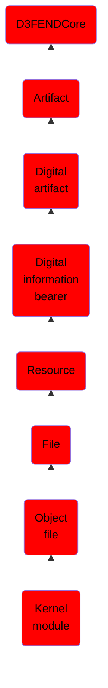

# Kernel module

## Overview

### Definition
A loadable kernel module (LKM) is an object file that contains code to extend the running kernel, or so-called base kernel, of an operating system. LKMs are typically used to add support for new hardware (as device drivers) and/or filesystems, or for adding system calls. When the functionality provided by a LKM is no longer required, it can be unloaded in order to free memory and other resources.

Most current Unix-like systems and Microsoft Windows support loadable kernel modules, although they might use a different name for them, such as kernel loadable module (kld) in FreeBSD, kernel extension (kext) in macOS,[1] kernel extension module in AIX, kernel-mode driver in Windows NT[2] and downloadable kernel module (DKM) in VxWorks. They are also known as kernel loadable modules (or KLM), and simply as kernel modules (KMOD).

### Examples
Not defined.

### Aliases
- Loadable Kernel Module
- LKM

### URI
http://d3fend.mitre.org/ontologies/d3fend.owl#KernelModule

### Subclass Of

- [D3FENDCore](/docs/ontology/reference/model/D3FENDCore/D3FENDCore.md)
- [Artifact](/docs/ontology/reference/model/D3FENDCore/Artifact/Artifact.md)
- [Digital artifact](/docs/ontology/reference/model/D3FENDCore/Artifact/Digital%20artifact/Digital%20artifact.md)
- [Digital information bearer](/docs/ontology/reference/model/D3FENDCore/Artifact/Digital%20artifact/Digital%20information%20bearer/Digital%20information%20bearer.md)
- [Resource](/docs/ontology/reference/model/D3FENDCore/Artifact/Digital%20artifact/Digital%20information%20bearer/Resource/Resource.md)
- [File](/docs/ontology/reference/model/D3FENDCore/Artifact/Digital%20artifact/Digital%20information%20bearer/Resource/File/File.md)
- [Object file](/docs/ontology/reference/model/D3FENDCore/Artifact/Digital%20artifact/Digital%20information%20bearer/Resource/File/Object%20file/Object%20file.md)
- [Kernel module](/docs/ontology/reference/model/D3FENDCore/Artifact/Digital%20artifact/Digital%20information%20bearer/Resource/File/Object%20file/Kernel%20module/Kernel%20module.md)

### Ontology Reference
- [d3fend](http://d3fend.mitre.org/ontologies/d3fend.owl#)

## Properties
### Data Properties
| Ontology | Label | Definition | Example | Domain | Range |
|----------|-------|------------|---------|--------|-------|
| d3fend | [d3fend-artifact-data-property](http://d3fend.mitre.org/ontologies/d3fend.owl#d3fend-artifact-data-property) | x d3fend-artifact-data-property y: The artifact x has the data property y. |  | [Digital Artifact](/docs/ontology/reference/model/D3FENDCore/Artifact/Digital%20artifact/Digital%20artifact.md) |  |

### Object Properties
| Ontology | Label | Definition | Example | Domain | Range | Inverse Of |
|----------|-------|------------|---------|--------|-------|------------|
| d3fend | [may-have-weakness](http://d3fend.mitre.org/ontologies/d3fend.owl#may-have-weakness) |  |  | [Artifact](/docs/ontology/reference/model/D3FENDCore/Artifact/Artifact.md) | [Weakness](/docs/ontology/reference/model/D3FENDCore/Weakness/Weakness.md) |  |

