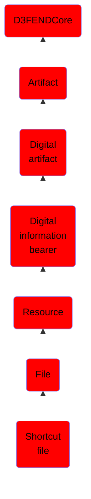

# Shortcut file

## Overview

### Definition
A shortcut file, or shortcut, is a handle that allows the user to find a file or resource located in a different directory or folder from the place where the shortcut is located.

Shortcuts, which are supported by the graphical file browsers of some operating systems, may resemble symbolic links but differ in a number of important ways. One difference is what type of software is able to follow them:

 - Symbolic links are automatically resolved by the file system. Any software program, upon accessing a symbolic link, will see the target instead, whether the program is aware of symbolic links or not.

 - Shortcuts are treated like ordinary files by the file system and by software programs that are not aware of them. Only software programs that understand shortcuts (such as the Windows shell and file browsers) treat them as references to other files.

Another difference are the capabilities of the mechanism:

 - Microsoft Windows shortcuts normally refer to a destination by an absolute path (starting from the root directory), whereas POSIX symbolic links can refer to destinations via either an absolute or a relative path. The latter is useful if both the location and destination of the symbolic link share a common path prefix[clarification needed], but that prefix is not yet known when the symbolic link is created (e.g., in an archive file that can be unpacked anywhere).

- Microsoft Windows application shortcuts contain additional metadata that can be associated with the destination, whereas POSIX symbolic links are just strings that will be interpreted as absolute or relative pathnames.

- Unlike symbolic links, Windows shortcuts maintain their references to their targets even when the target is moved or renamed. Windows domain clients may subscribe to a Windows service called Distributed Link Tracking to track the changes in files and folders to which they are interested. The service maintains the integrity of shortcuts, even when files and folders are moved across the network.[14] Additionally, in Windows 9x and later, Windows shell tries to find the target of a broken shortcut before proposing to delete it.

### Examples
Not defined.

### Aliases
Not defined.

### URI
http://d3fend.mitre.org/ontologies/d3fend.owl#ShortcutFile

### Subclass Of

- [D3FENDCore](/docs/ontology/reference/model/D3FENDCore/D3FENDCore.md)
- [Artifact](/docs/ontology/reference/model/D3FENDCore/Artifact/Artifact.md)
- [Digital artifact](/docs/ontology/reference/model/D3FENDCore/Artifact/Digital%20artifact/Digital%20artifact.md)
- [Digital information bearer](/docs/ontology/reference/model/D3FENDCore/Artifact/Digital%20artifact/Digital%20information%20bearer/Digital%20information%20bearer.md)
- [Resource](/docs/ontology/reference/model/D3FENDCore/Artifact/Digital%20artifact/Digital%20information%20bearer/Resource/Resource.md)
- [File](/docs/ontology/reference/model/D3FENDCore/Artifact/Digital%20artifact/Digital%20information%20bearer/Resource/File/File.md)
- [Shortcut file](/docs/ontology/reference/model/D3FENDCore/Artifact/Digital%20artifact/Digital%20information%20bearer/Resource/File/Shortcut%20file/Shortcut%20file.md)

### Ontology Reference
- [d3fend](http://d3fend.mitre.org/ontologies/d3fend.owl#)

## Properties
### Data Properties
| Ontology | Label | Definition | Example | Domain | Range |
|----------|-------|------------|---------|--------|-------|
| d3fend | [d3fend-artifact-data-property](http://d3fend.mitre.org/ontologies/d3fend.owl#d3fend-artifact-data-property) | x d3fend-artifact-data-property y: The artifact x has the data property y. |  | [Digital Artifact](/docs/ontology/reference/model/D3FENDCore/Artifact/Digital%20artifact/Digital%20artifact.md) |  |

### Object Properties
| Ontology | Label | Definition | Example | Domain | Range | Inverse Of |
|----------|-------|------------|---------|--------|-------|------------|
| d3fend | [may-have-weakness](http://d3fend.mitre.org/ontologies/d3fend.owl#may-have-weakness) |  |  | [Artifact](/docs/ontology/reference/model/D3FENDCore/Artifact/Artifact.md) | [Weakness](/docs/ontology/reference/model/D3FENDCore/Weakness/Weakness.md) |  |

