# Web file resource

## Overview

### Definition
A web file resource is a file resource identified by a Uniform Resource Identifier (URI) and made available from one host to another host via a web protocol and across a network or networks.

### Examples
Not defined.

### Aliases
Not defined.

### URI
http://d3fend.mitre.org/ontologies/d3fend.owl#WebFileResource

### Subclass Of

```mermaid
graph BT
    d3fend.owl#WebFileResource(Web<br>file<br>resource):::d3fend-->d3fend.owl#NetworkFileResource
    d3fend.owl#NetworkFileResource(Network<br>file<br>resource):::d3fend-->d3fend.owl#NetworkFileShareResource
    d3fend.owl#NetworkFileShareResource(Network<br>file<br>share<br>resource):::d3fend-->d3fend.owl#NetworkResource
    d3fend.owl#NetworkResource(Network<br>resource):::d3fend-->d3fend.owl#RemoteResource
    d3fend.owl#RemoteResource(Remote<br>resource):::d3fend-->d3fend.owl#Resource
    d3fend.owl#Resource(Resource):::d3fend-->d3fend.owl#DigitalInformationBearer
    d3fend.owl#DigitalInformationBearer(Digital<br>information<br>bearer):::d3fend-->d3fend.owl#DigitalArtifact
    d3fend.owl#DigitalArtifact(Digital<br>artifact):::d3fend-->d3fend.owl#Artifact
    d3fend.owl#Artifact(Artifact):::d3fend-->d3fend.owl#D3FENDCore
    d3fend.owl#D3FENDCore(D3FENDCore):::d3fend
    
    classDef bfo fill:#97c1fb,color:#060606
    classDef cco fill:#e4c51e,color:#060606
    classDef abi fill:#48DD82,color:#060606
    classDef attack fill:#FF0000,color:#060606
    classDef d3fend fill:#FF0000,color:#060606
```

- [D3FENDCore](/docs/ontology/reference/model/D3FENDCore/D3FENDCore.md)
- [Artifact](/docs/ontology/reference/model/D3FENDCore/Artifact/Artifact.md)
- [Digital artifact](/docs/ontology/reference/model/D3FENDCore/Artifact/Digital%20artifact/Digital%20artifact.md)
- [Digital information bearer](/docs/ontology/reference/model/D3FENDCore/Artifact/Digital%20artifact/Digital%20information%20bearer/Digital%20information%20bearer.md)
- [Resource](/docs/ontology/reference/model/D3FENDCore/Artifact/Digital%20artifact/Digital%20information%20bearer/Resource/Resource.md)
- [Remote resource](/docs/ontology/reference/model/D3FENDCore/Artifact/Digital%20artifact/Digital%20information%20bearer/Resource/Remote%20resource/Remote%20resource.md)
- [Network resource](/docs/ontology/reference/model/D3FENDCore/Artifact/Digital%20artifact/Digital%20information%20bearer/Resource/Remote%20resource/Network%20resource/Network%20resource.md)
- [Network file share resource](/docs/ontology/reference/model/D3FENDCore/Artifact/Digital%20artifact/Digital%20information%20bearer/Resource/Remote%20resource/Network%20resource/Network%20file%20share%20resource/Network%20file%20share%20resource.md)
- [Network file resource](/docs/ontology/reference/model/D3FENDCore/Artifact/Digital%20artifact/Digital%20information%20bearer/Resource/Remote%20resource/Network%20resource/Network%20file%20share%20resource/Network%20file%20resource/Network%20file%20resource.md)
- [Web file resource](/docs/ontology/reference/model/D3FENDCore/Artifact/Digital%20artifact/Digital%20information%20bearer/Resource/Remote%20resource/Network%20resource/Network%20file%20share%20resource/Network%20file%20resource/Web%20file%20resource/Web%20file%20resource.md)

### Ontology Reference
- [d3fend](http://d3fend.mitre.org/ontologies/d3fend.owl#)

## Properties
### Data Properties
| Ontology | Label | Definition | Example | Domain | Range |
|----------|-------|------------|---------|--------|-------|
| d3fend | [d3fend-artifact-data-property](http://d3fend.mitre.org/ontologies/d3fend.owl#d3fend-artifact-data-property) | x d3fend-artifact-data-property y: The artifact x has the data property y. |  | [Digital Artifact](/docs/ontology/reference/model/D3FENDCore/Artifact/Digital%20artifact/Digital%20artifact.md) |  |

### Object Properties
| Ontology | Label | Definition | Example | Domain | Range | Inverse Of |
|----------|-------|------------|---------|--------|-------|------------|
| d3fend | [may-have-weakness](http://d3fend.mitre.org/ontologies/d3fend.owl#may-have-weakness) |  |  | [Artifact](/docs/ontology/reference/model/D3FENDCore/Artifact/Artifact.md) | [Weakness](/docs/ontology/reference/model/D3FENDCore/Weakness/Weakness.md) |  |

