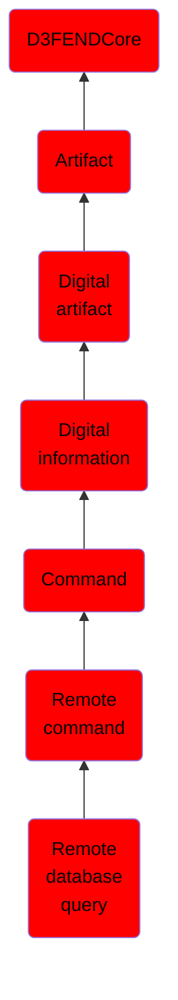

# Remote database query

## Overview

### Definition
A remote query session enabling a user to make an SQL, SPARQL, or similar query over the network from one host to another.

### Examples
Not defined.

### Aliases
Not defined.

### URI
http://d3fend.mitre.org/ontologies/d3fend.owl#RemoteDatabaseQuery

### Subclass Of

- [D3FENDCore](/docs/ontology/reference/model/D3FENDCore/D3FENDCore.md)
- [Artifact](/docs/ontology/reference/model/D3FENDCore/Artifact/Artifact.md)
- [Digital artifact](/docs/ontology/reference/model/D3FENDCore/Artifact/Digital%20artifact/Digital%20artifact.md)
- [Digital information](/docs/ontology/reference/model/D3FENDCore/Artifact/Digital%20artifact/Digital%20information/Digital%20information.md)
- [Command](/docs/ontology/reference/model/D3FENDCore/Artifact/Digital%20artifact/Digital%20information/Command/Command.md)
- [Remote command](/docs/ontology/reference/model/D3FENDCore/Artifact/Digital%20artifact/Digital%20information/Command/Remote%20command/Remote%20command.md)
- [Remote database query](/docs/ontology/reference/model/D3FENDCore/Artifact/Digital%20artifact/Digital%20information/Command/Remote%20command/Remote%20database%20query/Remote%20database%20query.md)

### Ontology Reference
- [d3fend](http://d3fend.mitre.org/ontologies/d3fend.owl#)

## Properties
### Data Properties
| Ontology | Label | Definition | Example | Domain | Range |
|----------|-------|------------|---------|--------|-------|
| d3fend | [d3fend-artifact-data-property](http://d3fend.mitre.org/ontologies/d3fend.owl#d3fend-artifact-data-property) | x d3fend-artifact-data-property y: The artifact x has the data property y. |  | [Digital Artifact](/docs/ontology/reference/model/D3FENDCore/Artifact/Digital%20artifact/Digital%20artifact.md) |  |

### Object Properties
| Ontology | Label | Definition | Example | Domain | Range | Inverse Of |
|----------|-------|------------|---------|--------|-------|------------|
| d3fend | [may-have-weakness](http://d3fend.mitre.org/ontologies/d3fend.owl#may-have-weakness) |  |  | [Artifact](/docs/ontology/reference/model/D3FENDCore/Artifact/Artifact.md) | [Weakness](/docs/ontology/reference/model/D3FENDCore/Weakness/Weakness.md) |  |

