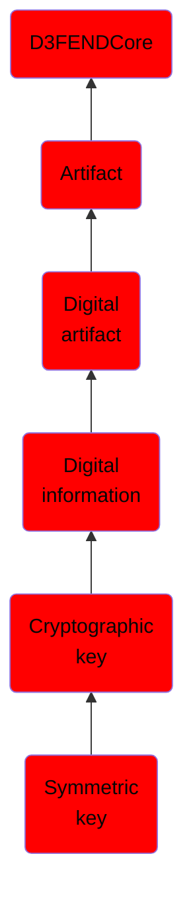

# Symmetric key

## Overview

### Definition
A symmetric key is a single key used for both encryption and decryption and used with a symmetric-key algorithm. Symmetric-key algorithms are algorithms for cryptography that use the same cryptographic keys for both encryption of plaintext and decryption of ciphertext. The keys may be identical or there may be a simple transformation to go between the two keys. The keys, in practice, represent a shared secret between two or more parties that can be used to maintain a private information link. This requirement that both parties have access to the secret key is one of the main drawbacks of symmetric key encryption, in comparison to public-key encrytption (also known as asymmetric key encryption).

### Examples
Not defined.

### Aliases
Not defined.

### URI
http://d3fend.mitre.org/ontologies/d3fend.owl#SymmetricKey

### Subclass Of

- [D3FENDCore](/docs/ontology/reference/model/D3FENDCore/D3FENDCore.md)
- [Artifact](/docs/ontology/reference/model/D3FENDCore/Artifact/Artifact.md)
- [Digital artifact](/docs/ontology/reference/model/D3FENDCore/Artifact/Digital%20artifact/Digital%20artifact.md)
- [Digital information](/docs/ontology/reference/model/D3FENDCore/Artifact/Digital%20artifact/Digital%20information/Digital%20information.md)
- [Cryptographic key](/docs/ontology/reference/model/D3FENDCore/Artifact/Digital%20artifact/Digital%20information/Cryptographic%20key/Cryptographic%20key.md)
- [Symmetric key](/docs/ontology/reference/model/D3FENDCore/Artifact/Digital%20artifact/Digital%20information/Cryptographic%20key/Symmetric%20key/Symmetric%20key.md)

### Ontology Reference
- [d3fend](http://d3fend.mitre.org/ontologies/d3fend.owl#)

## Properties
### Data Properties
| Ontology | Label | Definition | Example | Domain | Range |
|----------|-------|------------|---------|--------|-------|
| d3fend | [d3fend-artifact-data-property](http://d3fend.mitre.org/ontologies/d3fend.owl#d3fend-artifact-data-property) | x d3fend-artifact-data-property y: The artifact x has the data property y. |  | [Digital Artifact](/docs/ontology/reference/model/D3FENDCore/Artifact/Digital%20artifact/Digital%20artifact.md) |  |

### Object Properties
| Ontology | Label | Definition | Example | Domain | Range | Inverse Of |
|----------|-------|------------|---------|--------|-------|------------|
| d3fend | [may-have-weakness](http://d3fend.mitre.org/ontologies/d3fend.owl#may-have-weakness) |  |  | [Artifact](/docs/ontology/reference/model/D3FENDCore/Artifact/Artifact.md) | [Weakness](/docs/ontology/reference/model/D3FENDCore/Weakness/Weakness.md) |  |

