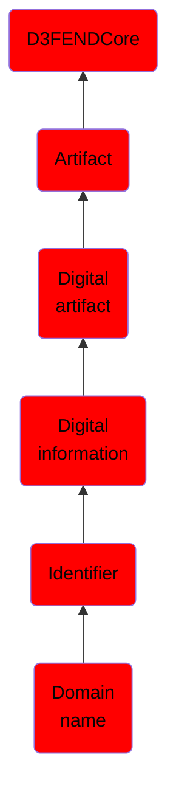

# Domain name

## Overview

### Definition
A domain name is an identification string that defines a realm of administrative autonomy, authority or control within the Internet. Domain names are formed by the rules and procedures of the Domain Name System (DNS). Any name registered in the DNS is a domain name.Domain names are used in various networking contexts and application-specific naming and addressing purposes. In general, a domain name represents an Internet Protocol (IP) resource, such as a personal computer used to access the Internet, a server computer hosting a web site, or the web site itself or any other service communicated via the Internet. In 2015, 294 million domain names had been registered.

### Examples
Not defined.

### Aliases
Not defined.

### URI
http://d3fend.mitre.org/ontologies/d3fend.owl#DomainName

### Subclass Of

- [D3FENDCore](/docs/ontology/reference/model/D3FENDCore/D3FENDCore.md)
- [Artifact](/docs/ontology/reference/model/D3FENDCore/Artifact/Artifact.md)
- [Digital artifact](/docs/ontology/reference/model/D3FENDCore/Artifact/Digital%20artifact/Digital%20artifact.md)
- [Digital information](/docs/ontology/reference/model/D3FENDCore/Artifact/Digital%20artifact/Digital%20information/Digital%20information.md)
- [Identifier](/docs/ontology/reference/model/D3FENDCore/Artifact/Digital%20artifact/Digital%20information/Identifier/Identifier.md)
- [Domain name](/docs/ontology/reference/model/D3FENDCore/Artifact/Digital%20artifact/Digital%20information/Identifier/Domain%20name/Domain%20name.md)

### Ontology Reference
- [d3fend](http://d3fend.mitre.org/ontologies/d3fend.owl#)

## Properties
### Data Properties
| Ontology | Label | Definition | Example | Domain | Range |
|----------|-------|------------|---------|--------|-------|
| d3fend | [d3fend-artifact-data-property](http://d3fend.mitre.org/ontologies/d3fend.owl#d3fend-artifact-data-property) | x d3fend-artifact-data-property y: The artifact x has the data property y. |  | [Digital Artifact](/docs/ontology/reference/model/D3FENDCore/Artifact/Digital%20artifact/Digital%20artifact.md) |  |

### Object Properties
| Ontology | Label | Definition | Example | Domain | Range | Inverse Of |
|----------|-------|------------|---------|--------|-------|------------|
| d3fend | [may-have-weakness](http://d3fend.mitre.org/ontologies/d3fend.owl#may-have-weakness) |  |  | [Artifact](/docs/ontology/reference/model/D3FENDCore/Artifact/Artifact.md) | [Weakness](/docs/ontology/reference/model/D3FENDCore/Weakness/Weakness.md) |  |

