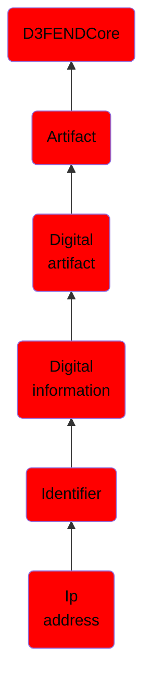

# Ip address

## Overview

### Definition
An Internet Protocol address (IP address) is a numerical label assigned to each device connected to a computer network that uses the Internet Protocol for communication.An IP address serves two main functions: host or network interface identification and location addressing. Internet Protocol version 4 (IPv4) defines an IP address as a 32-bit number. However, because of the growth of the Internet and the depletion of available IPv4 addresses, a new version of IP (IPv6), using 128 bits for the IP address, was standardized in 1998. IPv6 deployment has been ongoing since the mid-2000s.

### Examples
Not defined.

### Aliases
Not defined.

### URI
http://d3fend.mitre.org/ontologies/d3fend.owl#IPAddress

### Subclass Of

- [D3FENDCore](/docs/ontology/reference/model/D3FENDCore/D3FENDCore.md)
- [Artifact](/docs/ontology/reference/model/D3FENDCore/Artifact/Artifact.md)
- [Digital artifact](/docs/ontology/reference/model/D3FENDCore/Artifact/Digital%20artifact/Digital%20artifact.md)
- [Digital information](/docs/ontology/reference/model/D3FENDCore/Artifact/Digital%20artifact/Digital%20information/Digital%20information.md)
- [Identifier](/docs/ontology/reference/model/D3FENDCore/Artifact/Digital%20artifact/Digital%20information/Identifier/Identifier.md)
- [Ip address](/docs/ontology/reference/model/D3FENDCore/Artifact/Digital%20artifact/Digital%20information/Identifier/Ip%20address/Ip%20address.md)

### Ontology Reference
- [d3fend](http://d3fend.mitre.org/ontologies/d3fend.owl#)

## Properties
### Data Properties
| Ontology | Label | Definition | Example | Domain | Range |
|----------|-------|------------|---------|--------|-------|
| d3fend | [d3fend-artifact-data-property](http://d3fend.mitre.org/ontologies/d3fend.owl#d3fend-artifact-data-property) | x d3fend-artifact-data-property y: The artifact x has the data property y. |  | [Digital Artifact](/docs/ontology/reference/model/D3FENDCore/Artifact/Digital%20artifact/Digital%20artifact.md) |  |

### Object Properties
| Ontology | Label | Definition | Example | Domain | Range | Inverse Of |
|----------|-------|------------|---------|--------|-------|------------|
| d3fend | [may-have-weakness](http://d3fend.mitre.org/ontologies/d3fend.owl#may-have-weakness) |  |  | [Artifact](/docs/ontology/reference/model/D3FENDCore/Artifact/Artifact.md) | [Weakness](/docs/ontology/reference/model/D3FENDCore/Weakness/Weakness.md) |  |

