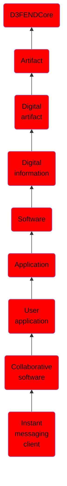

# Instant messaging client

## Overview

### Definition
Client software used to engage in Instant Messaging, a type of online chat that offers real-time text transmission over the Internet. A LAN messenger operates in a similar way over a local area network. Short messages are typically transmitted between two parties, when each user chooses to complete a thought and select "send". Some IM applications can use push technology to provide real-time text, which transmits messages character by character, as they are composed. More advanced instant messaging can add file transfer, clickable hyperlinks, Voice over IP, or video chat.

### Examples
Not defined.

### Aliases
Not defined.

### URI
http://d3fend.mitre.org/ontologies/d3fend.owl#InstantMessagingClient

### Subclass Of

- [D3FENDCore](/docs/ontology/reference/model/D3FENDCore/D3FENDCore.md)
- [Artifact](/docs/ontology/reference/model/D3FENDCore/Artifact/Artifact.md)
- [Digital artifact](/docs/ontology/reference/model/D3FENDCore/Artifact/Digital%20artifact/Digital%20artifact.md)
- [Digital information](/docs/ontology/reference/model/D3FENDCore/Artifact/Digital%20artifact/Digital%20information/Digital%20information.md)
- [Software](/docs/ontology/reference/model/D3FENDCore/Artifact/Digital%20artifact/Digital%20information/Software/Software.md)
- [Application](/docs/ontology/reference/model/D3FENDCore/Artifact/Digital%20artifact/Digital%20information/Software/Application/Application.md)
- [User application](/docs/ontology/reference/model/D3FENDCore/Artifact/Digital%20artifact/Digital%20information/Software/Application/User%20application/User%20application.md)
- [Collaborative software](/docs/ontology/reference/model/D3FENDCore/Artifact/Digital%20artifact/Digital%20information/Software/Application/User%20application/Collaborative%20software/Collaborative%20software.md)
- [Instant messaging client](/docs/ontology/reference/model/D3FENDCore/Artifact/Digital%20artifact/Digital%20information/Software/Application/User%20application/Collaborative%20software/Instant%20messaging%20client/Instant%20messaging%20client.md)

### Ontology Reference
- [d3fend](http://d3fend.mitre.org/ontologies/d3fend.owl#)

## Properties
### Data Properties
| Ontology | Label | Definition | Example | Domain | Range |
|----------|-------|------------|---------|--------|-------|
| d3fend | [d3fend-artifact-data-property](http://d3fend.mitre.org/ontologies/d3fend.owl#d3fend-artifact-data-property) | x d3fend-artifact-data-property y: The artifact x has the data property y. |  | [Digital Artifact](/docs/ontology/reference/model/D3FENDCore/Artifact/Digital%20artifact/Digital%20artifact.md) |  |

### Object Properties
| Ontology | Label | Definition | Example | Domain | Range | Inverse Of |
|----------|-------|------------|---------|--------|-------|------------|
| d3fend | [may-have-weakness](http://d3fend.mitre.org/ontologies/d3fend.owl#may-have-weakness) |  |  | [Artifact](/docs/ontology/reference/model/D3FENDCore/Artifact/Artifact.md) | [Weakness](/docs/ontology/reference/model/D3FENDCore/Weakness/Weakness.md) |  |

