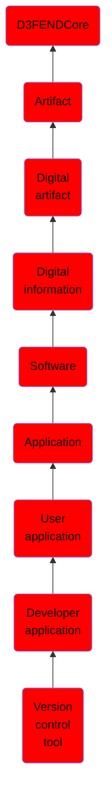

# Version control tool

## Overview

### Definition
Version control tools are tools that used to conduct version control. A  component of software configuration management, version control, also known as revision control, source control, or source code management systems are systems responsible for the management of changes to documents, computer programs, large web sites, and other collections of information. Changes are usually identified by a number or letter code, termed the "revision number", "revision level", or simply "revision". For example, an initial set of files is "revision 1". When the first change is made, the resulting set is "revision 2", and so on. Each revision is associated with a timestamp and the person making the change. Revisions can be compared, restored, and with some types of files, merged.

### Examples
Not defined.

### Aliases
- Source Control
- Revision Control

### URI
http://d3fend.mitre.org/ontologies/d3fend.owl#VersionControlTool

### Subclass Of

- [D3FENDCore](/docs/ontology/reference/model/D3FENDCore/D3FENDCore.md)
- [Artifact](/docs/ontology/reference/model/D3FENDCore/Artifact/Artifact.md)
- [Digital artifact](/docs/ontology/reference/model/D3FENDCore/Artifact/Digital%20artifact/Digital%20artifact.md)
- [Digital information](/docs/ontology/reference/model/D3FENDCore/Artifact/Digital%20artifact/Digital%20information/Digital%20information.md)
- [Software](/docs/ontology/reference/model/D3FENDCore/Artifact/Digital%20artifact/Digital%20information/Software/Software.md)
- [Application](/docs/ontology/reference/model/D3FENDCore/Artifact/Digital%20artifact/Digital%20information/Software/Application/Application.md)
- [User application](/docs/ontology/reference/model/D3FENDCore/Artifact/Digital%20artifact/Digital%20information/Software/Application/User%20application/User%20application.md)
- [Developer application](/docs/ontology/reference/model/D3FENDCore/Artifact/Digital%20artifact/Digital%20information/Software/Application/User%20application/Developer%20application/Developer%20application.md)
- [Version control tool](/docs/ontology/reference/model/D3FENDCore/Artifact/Digital%20artifact/Digital%20information/Software/Application/User%20application/Developer%20application/Version%20control%20tool/Version%20control%20tool.md)

### Ontology Reference
- [d3fend](http://d3fend.mitre.org/ontologies/d3fend.owl#)

## Properties
### Data Properties
| Ontology | Label | Definition | Example | Domain | Range |
|----------|-------|------------|---------|--------|-------|
| d3fend | [d3fend-artifact-data-property](http://d3fend.mitre.org/ontologies/d3fend.owl#d3fend-artifact-data-property) | x d3fend-artifact-data-property y: The artifact x has the data property y. |  | [Digital Artifact](/docs/ontology/reference/model/D3FENDCore/Artifact/Digital%20artifact/Digital%20artifact.md) |  |

### Object Properties
| Ontology | Label | Definition | Example | Domain | Range | Inverse Of |
|----------|-------|------------|---------|--------|-------|------------|
| d3fend | [may-have-weakness](http://d3fend.mitre.org/ontologies/d3fend.owl#may-have-weakness) |  |  | [Artifact](/docs/ontology/reference/model/D3FENDCore/Artifact/Artifact.md) | [Weakness](/docs/ontology/reference/model/D3FENDCore/Weakness/Weakness.md) |  |

