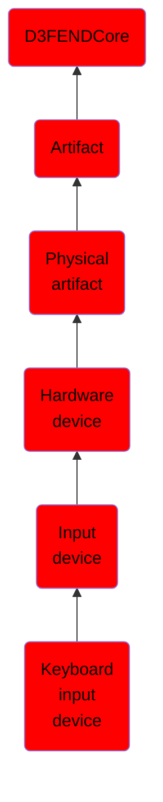

# Keyboard input device

## Overview

### Definition
A computer keyboard is a typewriter-style device which uses an arrangement of buttons or keys to act as mechanical levers or electronic switches. Following the decline of punch cards and paper tape, interaction via teleprinter-style keyboards became the main input method for computers. A keyboard is also used to give commands to the operating system of a computer, such as Windows' Control-Alt-Delete combination. Although on Pre-Windows 95 Microsoft operating systems this forced a re-boot, now it brings up a system security options screen.

### Examples
Not defined.

### Aliases
- Keyboard
- Computer Keyboard

### URI
http://d3fend.mitre.org/ontologies/d3fend.owl#KeyboardInputDevice

### Subclass Of

- [D3FENDCore](/docs/ontology/reference/model/D3FENDCore/D3FENDCore.md)
- [Artifact](/docs/ontology/reference/model/D3FENDCore/Artifact/Artifact.md)
- [Physical artifact](/docs/ontology/reference/model/D3FENDCore/Artifact/Physical%20artifact/Physical%20artifact.md)
- [Hardware device](/docs/ontology/reference/model/D3FENDCore/Artifact/Physical%20artifact/Hardware%20device/Hardware%20device.md)
- [Input device](/docs/ontology/reference/model/D3FENDCore/Artifact/Physical%20artifact/Hardware%20device/Input%20device/Input%20device.md)
- [Keyboard input device](/docs/ontology/reference/model/D3FENDCore/Artifact/Physical%20artifact/Hardware%20device/Input%20device/Keyboard%20input%20device/Keyboard%20input%20device.md)

### Ontology Reference
- [d3fend](http://d3fend.mitre.org/ontologies/d3fend.owl#)

## Properties
### Object Properties
| Ontology | Label | Definition | Example | Domain | Range | Inverse Of |
|----------|-------|------------|---------|--------|-------|------------|
| d3fend | [may-have-weakness](http://d3fend.mitre.org/ontologies/d3fend.owl#may-have-weakness) |  |  | [Artifact](/docs/ontology/reference/model/D3FENDCore/Artifact/Artifact.md) | [Weakness](/docs/ontology/reference/model/D3FENDCore/Weakness/Weakness.md) |  |

