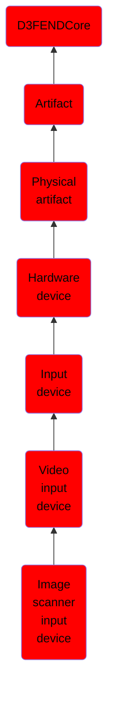

# Image scanner input device

## Overview

### Definition
An image scanner -- often abbreviated to just scanner, is a device that optically scans images, printed text, handwriting or an object and converts it to a digital image. Commonly used in offices are variations of the desktop flatbed scanner where the document is placed on a glass window for scanning. Hand-held scanners, where the device is moved by hand, have evolved from text scanning "wands" to 3D scanners used for industrial design, reverse engineering, test and measurement, orthotics, gaming and other applications. Mechanically driven scanners that move the document are typically used for large-format documents, where a flatbed design would be impractical.

### Examples
Not defined.

### Aliases
Scanner

### URI
http://d3fend.mitre.org/ontologies/d3fend.owl#ImageScannerInputDevice

### Subclass Of

- [D3FENDCore](/docs/ontology/reference/model/D3FENDCore/D3FENDCore.md)
- [Artifact](/docs/ontology/reference/model/D3FENDCore/Artifact/Artifact.md)
- [Physical artifact](/docs/ontology/reference/model/D3FENDCore/Artifact/Physical%20artifact/Physical%20artifact.md)
- [Hardware device](/docs/ontology/reference/model/D3FENDCore/Artifact/Physical%20artifact/Hardware%20device/Hardware%20device.md)
- [Input device](/docs/ontology/reference/model/D3FENDCore/Artifact/Physical%20artifact/Hardware%20device/Input%20device/Input%20device.md)
- [Video input device](/docs/ontology/reference/model/D3FENDCore/Artifact/Physical%20artifact/Hardware%20device/Input%20device/Video%20input%20device/Video%20input%20device.md)
- [Image scanner input device](/docs/ontology/reference/model/D3FENDCore/Artifact/Physical%20artifact/Hardware%20device/Input%20device/Video%20input%20device/Image%20scanner%20input%20device/Image%20scanner%20input%20device.md)

### Ontology Reference
- [d3fend](http://d3fend.mitre.org/ontologies/d3fend.owl#)

## Properties
### Object Properties
| Ontology | Label | Definition | Example | Domain | Range | Inverse Of |
|----------|-------|------------|---------|--------|-------|------------|
| d3fend | [may-have-weakness](http://d3fend.mitre.org/ontologies/d3fend.owl#may-have-weakness) |  |  | [Artifact](/docs/ontology/reference/model/D3FENDCore/Artifact/Artifact.md) | [Weakness](/docs/ontology/reference/model/D3FENDCore/Weakness/Weakness.md) |  |

