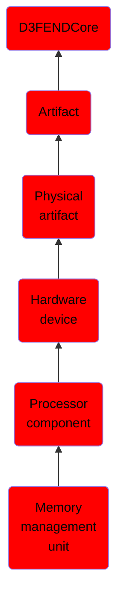

# Memory management unit

## Overview

### Definition
A computer’s memory management unit (MMU) is the physical hardware that handles its virtual memory and caching operations. The MMU is usually located within the computer’s central processing unit (CPU), but sometimes operates in a separate integrated chip (IC).

### Examples
Not defined.

### Aliases
Not defined.

### URI
http://d3fend.mitre.org/ontologies/d3fend.owl#MemoryManagementUnit

### Subclass Of

- [D3FENDCore](/docs/ontology/reference/model/D3FENDCore/D3FENDCore.md)
- [Artifact](/docs/ontology/reference/model/D3FENDCore/Artifact/Artifact.md)
- [Physical artifact](/docs/ontology/reference/model/D3FENDCore/Artifact/Physical%20artifact/Physical%20artifact.md)
- [Hardware device](/docs/ontology/reference/model/D3FENDCore/Artifact/Physical%20artifact/Hardware%20device/Hardware%20device.md)
- [Processor component](/docs/ontology/reference/model/D3FENDCore/Artifact/Physical%20artifact/Hardware%20device/Processor%20component/Processor%20component.md)
- [Memory management unit](/docs/ontology/reference/model/D3FENDCore/Artifact/Physical%20artifact/Hardware%20device/Processor%20component/Memory%20management%20unit/Memory%20management%20unit.md)

### Ontology Reference
- [d3fend](http://d3fend.mitre.org/ontologies/d3fend.owl#)

## Properties
### Object Properties
| Ontology | Label | Definition | Example | Domain | Range | Inverse Of |
|----------|-------|------------|---------|--------|-------|------------|
| d3fend | [may-have-weakness](http://d3fend.mitre.org/ontologies/d3fend.owl#may-have-weakness) |  |  | [Artifact](/docs/ontology/reference/model/D3FENDCore/Artifact/Artifact.md) | [Weakness](/docs/ontology/reference/model/D3FENDCore/Weakness/Weakness.md) |  |

