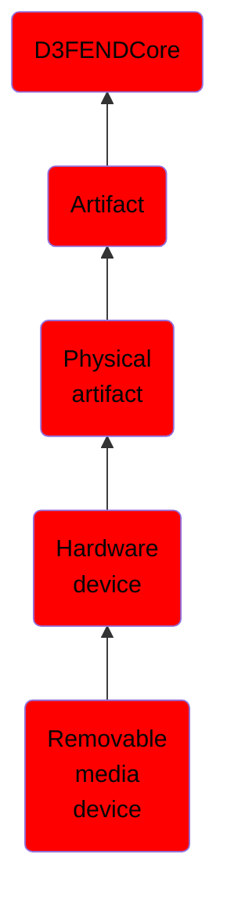

# Removable media device

## Overview

### Definition
A removable media device is a hardware device used for computer storage and that is designed to be inserted and removed from the system.  It is distinct from other removable media in that all the hardware required to read the data are built into the device.  So USB flash drives and external hard drives are removable media devices, whereas tapes and disks are not, as they require additional hardware to perform read/write operations.

### Examples
Not defined.

### Aliases
Not defined.

### URI
http://d3fend.mitre.org/ontologies/d3fend.owl#RemovableMediaDevice

### Subclass Of

- [D3FENDCore](/docs/ontology/reference/model/D3FENDCore/D3FENDCore.md)
- [Artifact](/docs/ontology/reference/model/D3FENDCore/Artifact/Artifact.md)
- [Physical artifact](/docs/ontology/reference/model/D3FENDCore/Artifact/Physical%20artifact/Physical%20artifact.md)
- [Hardware device](/docs/ontology/reference/model/D3FENDCore/Artifact/Physical%20artifact/Hardware%20device/Hardware%20device.md)
- [Removable media device](/docs/ontology/reference/model/D3FENDCore/Artifact/Physical%20artifact/Hardware%20device/Removable%20media%20device/Removable%20media%20device.md)

### Ontology Reference
- [d3fend](http://d3fend.mitre.org/ontologies/d3fend.owl#)

## Properties
### Object Properties
| Ontology | Label | Definition | Example | Domain | Range | Inverse Of |
|----------|-------|------------|---------|--------|-------|------------|
| d3fend | [may-have-weakness](http://d3fend.mitre.org/ontologies/d3fend.owl#may-have-weakness) |  |  | [Artifact](/docs/ontology/reference/model/D3FENDCore/Artifact/Artifact.md) | [Weakness](/docs/ontology/reference/model/D3FENDCore/Weakness/Weakness.md) |  |

