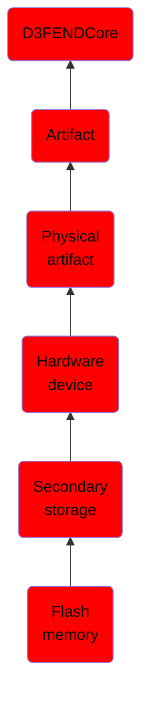

# Flash memory

## Overview

### Definition
Flash memory is an electronic non-volatile computer memory storage medium that can be electrically erased and reprogrammed.

### Examples
Not defined.

### Aliases
Not defined.

### URI
http://d3fend.mitre.org/ontologies/d3fend.owl#FlashMemory

### Subclass Of

- [D3FENDCore](/docs/ontology/reference/model/D3FENDCore/D3FENDCore.md)
- [Artifact](/docs/ontology/reference/model/D3FENDCore/Artifact/Artifact.md)
- [Physical artifact](/docs/ontology/reference/model/D3FENDCore/Artifact/Physical%20artifact/Physical%20artifact.md)
- [Hardware device](/docs/ontology/reference/model/D3FENDCore/Artifact/Physical%20artifact/Hardware%20device/Hardware%20device.md)
- [Secondary storage](/docs/ontology/reference/model/D3FENDCore/Artifact/Physical%20artifact/Hardware%20device/Secondary%20storage/Secondary%20storage.md)
- [Flash memory](/docs/ontology/reference/model/D3FENDCore/Artifact/Physical%20artifact/Hardware%20device/Secondary%20storage/Flash%20memory/Flash%20memory.md)

### Ontology Reference
- [d3fend](http://d3fend.mitre.org/ontologies/d3fend.owl#)

## Properties
### Object Properties
| Ontology | Label | Definition | Example | Domain | Range | Inverse Of |
|----------|-------|------------|---------|--------|-------|------------|
| d3fend | [may-have-weakness](http://d3fend.mitre.org/ontologies/d3fend.owl#may-have-weakness) |  |  | [Artifact](/docs/ontology/reference/model/D3FENDCore/Artifact/Artifact.md) | [Weakness](/docs/ontology/reference/model/D3FENDCore/Weakness/Weakness.md) |  |

