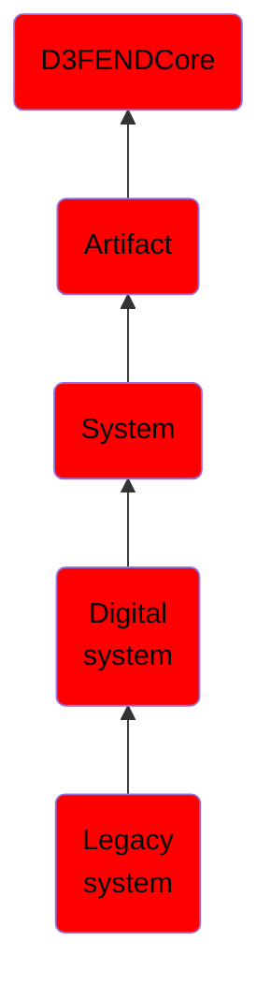

# Legacy system

## Overview

### Definition
In computing, a legacy system is an old method, technology, computer system, or application program, "of, relating to, or being a previous or outdated computer system," yet still in use. Often referencing a system as "legacy" means that it paved the way for the standards that would follow it. This can also imply that the system is out of date or in need of replacement.

### Examples
Not defined.

### Aliases
Not defined.

### URI
http://d3fend.mitre.org/ontologies/d3fend.owl#LegacySystem

### Subclass Of

- [D3FENDCore](/docs/ontology/reference/model/D3FENDCore/D3FENDCore.md)
- [Artifact](/docs/ontology/reference/model/D3FENDCore/Artifact/Artifact.md)
- [System](/docs/ontology/reference/model/D3FENDCore/Artifact/System/System.md)
- [Digital system](/docs/ontology/reference/model/D3FENDCore/Artifact/System/Digital%20system/Digital%20system.md)
- [Legacy system](/docs/ontology/reference/model/D3FENDCore/Artifact/System/Digital%20system/Legacy%20system/Legacy%20system.md)

### Ontology Reference
- [d3fend](http://d3fend.mitre.org/ontologies/d3fend.owl#)

## Properties
### Object Properties
| Ontology | Label | Definition | Example | Domain | Range | Inverse Of |
|----------|-------|------------|---------|--------|-------|------------|
| d3fend | [may-have-weakness](http://d3fend.mitre.org/ontologies/d3fend.owl#may-have-weakness) |  |  | [Artifact](/docs/ontology/reference/model/D3FENDCore/Artifact/Artifact.md) | [Weakness](/docs/ontology/reference/model/D3FENDCore/Weakness/Weakness.md) |  |

