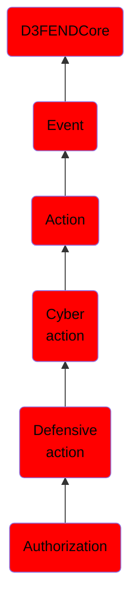

# Authorization

## Overview

### Definition
Authorization is the function of specifying access rights to resources related to information security and computer security in general and to access control in particular. More formally, "to authorize" is to define an access policy. For example, human resources staff is normally authorized to access employee records and this policy is usually formalized as access control rules in a computer system. During operation, the system uses the access control rules to decide whether access requests from (authenticated) consumers shall be approved (granted) or disapproved (rejected). Resources include individual files or an item's data, computer programs, computer devices and functionality provided by computer applications. Examples of consumers are computer users, computer program

### Examples
Not defined.

### Aliases
Not defined.

### URI
http://d3fend.mitre.org/ontologies/d3fend.owl#Authorization

### Subclass Of

- [D3FENDCore](/docs/ontology/reference/model/D3FENDCore/D3FENDCore.md)
- [Event](/docs/ontology/reference/model/D3FENDCore/Event/Event.md)
- [Action](/docs/ontology/reference/model/D3FENDCore/Event/Action/Action.md)
- [Cyber action](/docs/ontology/reference/model/D3FENDCore/Event/Action/Cyber%20action/Cyber%20action.md)
- [Defensive action](/docs/ontology/reference/model/D3FENDCore/Event/Action/Cyber%20action/Defensive%20action/Defensive%20action.md)
- [Authorization](/docs/ontology/reference/model/D3FENDCore/Event/Action/Cyber%20action/Defensive%20action/Authorization/Authorization.md)

### Ontology Reference
- [d3fend](http://d3fend.mitre.org/ontologies/d3fend.owl#)

## Properties
