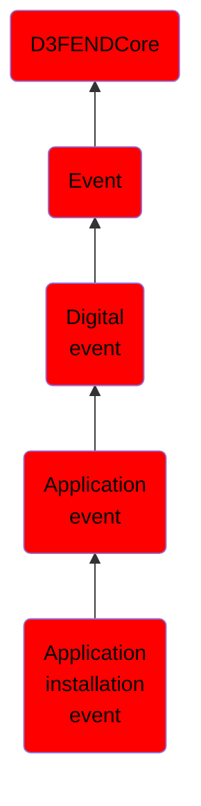

# Application installation event

## Overview

### Definition
An event representing the installation of an application onto a system, making it available for use and interaction.

### Examples
Not defined.

### Aliases
Not defined.

### URI
http://d3fend.mitre.org/ontologies/d3fend.owl#ApplicationInstallationEvent

### Subclass Of

- [D3FENDCore](/docs/ontology/reference/model/D3FENDCore/D3FENDCore.md)
- [Event](/docs/ontology/reference/model/D3FENDCore/Event/Event.md)
- [Digital event](/docs/ontology/reference/model/D3FENDCore/Event/Digital%20event/Digital%20event.md)
- [Application event](/docs/ontology/reference/model/D3FENDCore/Event/Digital%20event/Application%20event/Application%20event.md)
- [Application installation event](/docs/ontology/reference/model/D3FENDCore/Event/Digital%20event/Application%20event/Application%20installation%20event/Application%20installation%20event.md)

### Ontology Reference
- [d3fend](http://d3fend.mitre.org/ontologies/d3fend.owl#)

## Properties
