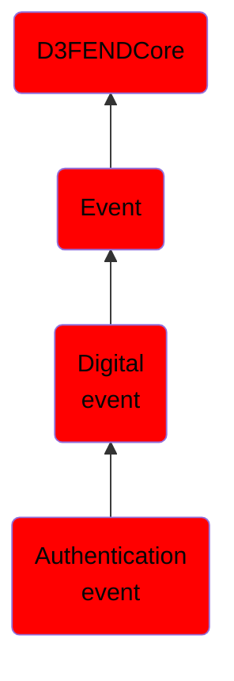

# Authentication event

## Overview

### Definition
An event capturing the systematic process of verifying an agent's identity within a system, involving credential validation and identity confirmation.

### Examples
Not defined.

### Aliases
Agent Authentication Event

### URI
http://d3fend.mitre.org/ontologies/d3fend.owl#AuthenticationEvent

### Subclass Of

- [D3FENDCore](/docs/ontology/reference/model/D3FENDCore/D3FENDCore.md)
- [Event](/docs/ontology/reference/model/D3FENDCore/Event/Event.md)
- [Digital event](/docs/ontology/reference/model/D3FENDCore/Event/Digital%20event/Digital%20event.md)
- [Authentication event](/docs/ontology/reference/model/D3FENDCore/Event/Digital%20event/Authentication%20event/Authentication%20event.md)

### Ontology Reference
- [d3fend](http://d3fend.mitre.org/ontologies/d3fend.owl#)

## Properties
