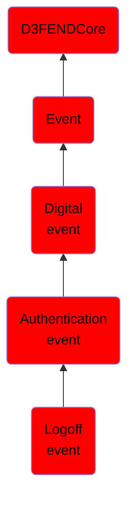

# Logoff event

## Overview

### Definition
An authentication event where an active session is conclusively terminated, resulting in the cessation of access and deallocation of resources associated with the session, ensuring that the connection to the system, application, or resource no longer exists.

### Examples
Not defined.

### Aliases
Not defined.

### URI
http://d3fend.mitre.org/ontologies/d3fend.owl#LogoffEvent

### Subclass Of

- [D3FENDCore](/docs/ontology/reference/model/D3FENDCore/D3FENDCore.md)
- [Event](/docs/ontology/reference/model/D3FENDCore/Event/Event.md)
- [Digital event](/docs/ontology/reference/model/D3FENDCore/Event/Digital%20event/Digital%20event.md)
- [Authentication event](/docs/ontology/reference/model/D3FENDCore/Event/Digital%20event/Authentication%20event/Authentication%20event.md)
- [Logoff event](/docs/ontology/reference/model/D3FENDCore/Event/Digital%20event/Authentication%20event/Logoff%20event/Logoff%20event.md)

### Ontology Reference
- [d3fend](http://d3fend.mitre.org/ontologies/d3fend.owl#)

## Properties
