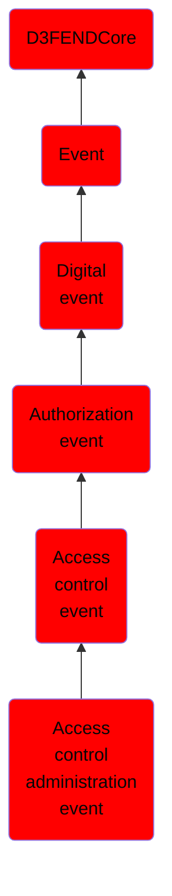

# Access control administration event

## Overview

### Definition
An event concerning the administrative actions of setting, modifying, or abolishing permissions, configuring access control settings, and managing user access rights to ensure alignment with access control policies.

### Examples
Not defined.

### Aliases
- Permission Provisioning Event
- Permission Administration Event

### URI
http://d3fend.mitre.org/ontologies/d3fend.owl#AccessControlAdministrationEvent

### Subclass Of

- [D3FENDCore](/docs/ontology/reference/model/D3FENDCore/D3FENDCore.md)
- [Event](/docs/ontology/reference/model/D3FENDCore/Event/Event.md)
- [Digital event](/docs/ontology/reference/model/D3FENDCore/Event/Digital%20event/Digital%20event.md)
- [Authorization event](/docs/ontology/reference/model/D3FENDCore/Event/Digital%20event/Authorization%20event/Authorization%20event.md)
- [Access control event](/docs/ontology/reference/model/D3FENDCore/Event/Digital%20event/Authorization%20event/Access%20control%20event/Access%20control%20event.md)
- [Access control administration event](/docs/ontology/reference/model/D3FENDCore/Event/Digital%20event/Authorization%20event/Access%20control%20event/Access%20control%20administration%20event/Access%20control%20administration%20event.md)

### Ontology Reference
- [d3fend](http://d3fend.mitre.org/ontologies/d3fend.owl#)

## Properties
