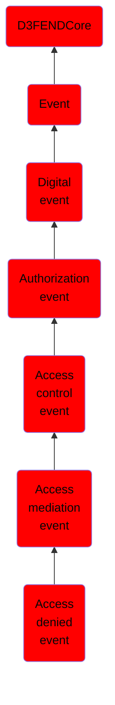

# Access denied event

## Overview

### Definition
An event indicating the refusal of access to a resource, where an access request has been evaluated and denied based on current authorization policies, preventing operations by the requesting agent.

### Examples
Not defined.

### Aliases
Not defined.

### URI
http://d3fend.mitre.org/ontologies/d3fend.owl#AccessDeniedEvent

### Subclass Of

- [D3FENDCore](/docs/ontology/reference/model/D3FENDCore/D3FENDCore.md)
- [Event](/docs/ontology/reference/model/D3FENDCore/Event/Event.md)
- [Digital event](/docs/ontology/reference/model/D3FENDCore/Event/Digital%20event/Digital%20event.md)
- [Authorization event](/docs/ontology/reference/model/D3FENDCore/Event/Digital%20event/Authorization%20event/Authorization%20event.md)
- [Access control event](/docs/ontology/reference/model/D3FENDCore/Event/Digital%20event/Authorization%20event/Access%20control%20event/Access%20control%20event.md)
- [Access mediation event](/docs/ontology/reference/model/D3FENDCore/Event/Digital%20event/Authorization%20event/Access%20control%20event/Access%20mediation%20event/Access%20mediation%20event.md)
- [Access denied event](/docs/ontology/reference/model/D3FENDCore/Event/Digital%20event/Authorization%20event/Access%20control%20event/Access%20mediation%20event/Access%20denied%20event/Access%20denied%20event.md)

### Ontology Reference
- [d3fend](http://d3fend.mitre.org/ontologies/d3fend.owl#)

## Properties
