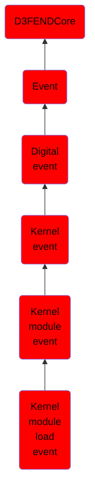

# Kernel module load event

## Overview

### Definition
An event representing the loading of a kernel module, such as a device driver or dynamically linked extension, into the operating system kernel to extend or modify its capabilities.

### Examples
Not defined.

### Aliases
Not defined.

### URI
http://d3fend.mitre.org/ontologies/d3fend.owl#KernelModuleLoadEvent

### Subclass Of

- [D3FENDCore](/docs/ontology/reference/model/D3FENDCore/D3FENDCore.md)
- [Event](/docs/ontology/reference/model/D3FENDCore/Event/Event.md)
- [Digital event](/docs/ontology/reference/model/D3FENDCore/Event/Digital%20event/Digital%20event.md)
- [Kernel event](/docs/ontology/reference/model/D3FENDCore/Event/Digital%20event/Kernel%20event/Kernel%20event.md)
- [Kernel module event](/docs/ontology/reference/model/D3FENDCore/Event/Digital%20event/Kernel%20event/Kernel%20module%20event/Kernel%20module%20event.md)
- [Kernel module load event](/docs/ontology/reference/model/D3FENDCore/Event/Digital%20event/Kernel%20event/Kernel%20module%20event/Kernel%20module%20load%20event/Kernel%20module%20load%20event.md)

### Ontology Reference
- [d3fend](http://d3fend.mitre.org/ontologies/d3fend.owl#)

## Properties
