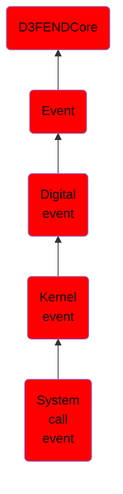

# System call event

## Overview

### Definition
An event where a user-space process requests a service or resource from the operating system kernel through a system call interface, enabling controlled interactions with hardware or kernel-level operations.

### Examples
Not defined.

### Aliases
Not defined.

### URI
http://d3fend.mitre.org/ontologies/d3fend.owl#SystemCallEvent

### Subclass Of

- [D3FENDCore](/docs/ontology/reference/model/D3FENDCore/D3FENDCore.md)
- [Event](/docs/ontology/reference/model/D3FENDCore/Event/Event.md)
- [Digital event](/docs/ontology/reference/model/D3FENDCore/Event/Digital%20event/Digital%20event.md)
- [Kernel event](/docs/ontology/reference/model/D3FENDCore/Event/Digital%20event/Kernel%20event/Kernel%20event.md)
- [System call event](/docs/ontology/reference/model/D3FENDCore/Event/Digital%20event/Kernel%20event/System%20call%20event/System%20call%20event.md)

### Ontology Reference
- [d3fend](http://d3fend.mitre.org/ontologies/d3fend.owl#)

## Properties
