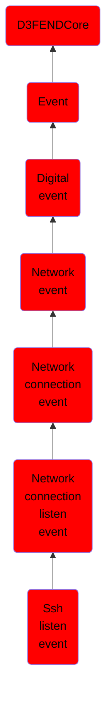

# Ssh listen event

## Overview

### Definition
An event indicating that an SSH server has started listening for incoming connection requests, enabling potential clients to initiate secure sessions.

### Examples
Not defined.

### Aliases
Not defined.

### URI
http://d3fend.mitre.org/ontologies/d3fend.owl#SSHListenEvent

### Subclass Of

- [D3FENDCore](/docs/ontology/reference/model/D3FENDCore/D3FENDCore.md)
- [Event](/docs/ontology/reference/model/D3FENDCore/Event/Event.md)
- [Digital event](/docs/ontology/reference/model/D3FENDCore/Event/Digital%20event/Digital%20event.md)
- [Network event](/docs/ontology/reference/model/D3FENDCore/Event/Digital%20event/Network%20event/Network%20event.md)
- [Network connection event](/docs/ontology/reference/model/D3FENDCore/Event/Digital%20event/Network%20event/Network%20connection%20event/Network%20connection%20event.md)
- [Network connection listen event](/docs/ontology/reference/model/D3FENDCore/Event/Digital%20event/Network%20event/Network%20connection%20event/Network%20connection%20listen%20event/Network%20connection%20listen%20event.md)
- [Ssh listen event](/docs/ontology/reference/model/D3FENDCore/Event/Digital%20event/Network%20event/Network%20connection%20event/Network%20connection%20listen%20event/Ssh%20listen%20event/Ssh%20listen%20event.md)

### Ontology Reference
- [d3fend](http://d3fend.mitre.org/ontologies/d3fend.owl#)

## Properties
