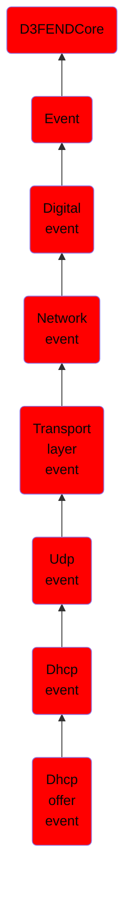

# Dhcp offer event

## Overview

### Definition
An event where a DHCP server sends an OFFER message to a client in response to a DISCOVER request, proposing an IP address and associated configuration parameters.

### Examples
Not defined.

### Aliases
DHCPOFFER

### URI
http://d3fend.mitre.org/ontologies/d3fend.owl#DHCPOfferEvent

### Subclass Of

- [D3FENDCore](/docs/ontology/reference/model/D3FENDCore/D3FENDCore.md)
- [Event](/docs/ontology/reference/model/D3FENDCore/Event/Event.md)
- [Digital event](/docs/ontology/reference/model/D3FENDCore/Event/Digital%20event/Digital%20event.md)
- [Network event](/docs/ontology/reference/model/D3FENDCore/Event/Digital%20event/Network%20event/Network%20event.md)
- [Transport layer event](/docs/ontology/reference/model/D3FENDCore/Event/Digital%20event/Network%20event/Transport%20layer%20event/Transport%20layer%20event.md)
- [Udp event](/docs/ontology/reference/model/D3FENDCore/Event/Digital%20event/Network%20event/Transport%20layer%20event/Udp%20event/Udp%20event.md)
- [Dhcp event](/docs/ontology/reference/model/D3FENDCore/Event/Digital%20event/Network%20event/Transport%20layer%20event/Udp%20event/Dhcp%20event/Dhcp%20event.md)
- [Dhcp offer event](/docs/ontology/reference/model/D3FENDCore/Event/Digital%20event/Network%20event/Transport%20layer%20event/Udp%20event/Dhcp%20event/Dhcp%20offer%20event/Dhcp%20offer%20event.md)

### Ontology Reference
- [d3fend](http://d3fend.mitre.org/ontologies/d3fend.owl#)

## Properties
