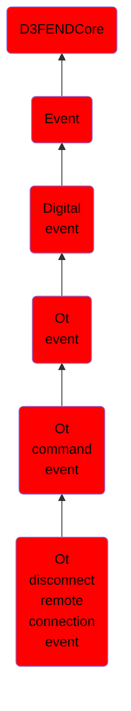

# Ot disconnect remote connection event

## Overview

### Definition
Not defined.

### Examples
Not defined.

### Aliases
Not defined.

### URI
http://d3fend.mitre.org/ontologies/d3fend.owl#OTDisconnectRemoteConnectionEvent

### Subclass Of

- [D3FENDCore](/docs/ontology/reference/model/D3FENDCore/D3FENDCore.md)
- [Event](/docs/ontology/reference/model/D3FENDCore/Event/Event.md)
- [Digital event](/docs/ontology/reference/model/D3FENDCore/Event/Digital%20event/Digital%20event.md)
- [Ot event](/docs/ontology/reference/model/D3FENDCore/Event/Digital%20event/Ot%20event/Ot%20event.md)
- [Ot command event](/docs/ontology/reference/model/D3FENDCore/Event/Digital%20event/Ot%20event/Ot%20command%20event/Ot%20command%20event.md)
- [Ot disconnect remote connection event](/docs/ontology/reference/model/D3FENDCore/Event/Digital%20event/Ot%20event/Ot%20command%20event/Ot%20disconnect%20remote%20connection%20event/Ot%20disconnect%20remote%20connection%20event.md)

### Ontology Reference
- [d3fend](http://d3fend.mitre.org/ontologies/d3fend.owl#)

## Properties
