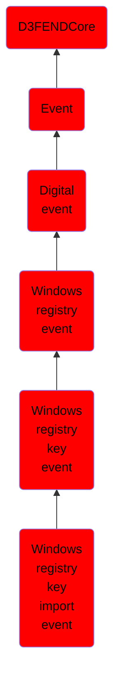

# Windows registry key import event

## Overview

### Definition
An event where registry key data is imported into the Windows Registry from an external source.

### Examples
Not defined.

### Aliases
Not defined.

### URI
http://d3fend.mitre.org/ontologies/d3fend.owl#WindowsRegistryKeyImportEvent

### Subclass Of

- [D3FENDCore](/docs/ontology/reference/model/D3FENDCore/D3FENDCore.md)
- [Event](/docs/ontology/reference/model/D3FENDCore/Event/Event.md)
- [Digital event](/docs/ontology/reference/model/D3FENDCore/Event/Digital%20event/Digital%20event.md)
- [Windows registry event](/docs/ontology/reference/model/D3FENDCore/Event/Digital%20event/Windows%20registry%20event/Windows%20registry%20event.md)
- [Windows registry key event](/docs/ontology/reference/model/D3FENDCore/Event/Digital%20event/Windows%20registry%20event/Windows%20registry%20key%20event/Windows%20registry%20key%20event.md)
- [Windows registry key import event](/docs/ontology/reference/model/D3FENDCore/Event/Digital%20event/Windows%20registry%20event/Windows%20registry%20key%20event/Windows%20registry%20key%20import%20event/Windows%20registry%20key%20import%20event.md)

### Ontology Reference
- [d3fend](http://d3fend.mitre.org/ontologies/d3fend.owl#)

## Properties
