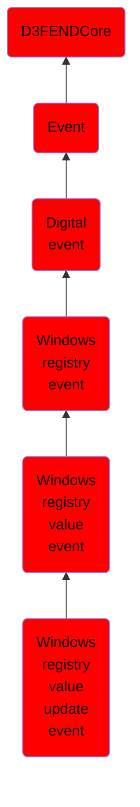

# Windows registry value update event

## Overview

### Definition
An event indicating changes to the data or configuration of an existing registry value within the Windows Registry.

### Examples
Not defined.

### Aliases
Not defined.

### URI
http://d3fend.mitre.org/ontologies/d3fend.owl#WindowsRegistryValueUpdateEvent

### Subclass Of

- [D3FENDCore](/docs/ontology/reference/model/D3FENDCore/D3FENDCore.md)
- [Event](/docs/ontology/reference/model/D3FENDCore/Event/Event.md)
- [Digital event](/docs/ontology/reference/model/D3FENDCore/Event/Digital%20event/Digital%20event.md)
- [Windows registry event](/docs/ontology/reference/model/D3FENDCore/Event/Digital%20event/Windows%20registry%20event/Windows%20registry%20event.md)
- [Windows registry value event](/docs/ontology/reference/model/D3FENDCore/Event/Digital%20event/Windows%20registry%20event/Windows%20registry%20value%20event/Windows%20registry%20value%20event.md)
- [Windows registry value update event](/docs/ontology/reference/model/D3FENDCore/Event/Digital%20event/Windows%20registry%20event/Windows%20registry%20value%20event/Windows%20registry%20value%20update%20event/Windows%20registry%20value%20update%20event.md)

### Ontology Reference
- [d3fend](http://d3fend.mitre.org/ontologies/d3fend.owl#)

## Properties
