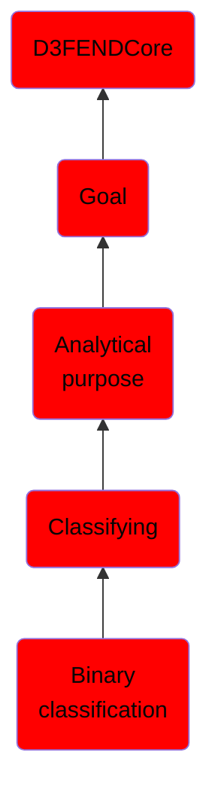

# Binary classification

## Overview

### Definition
Not defined.

### Examples
Not defined.

### Aliases
Not defined.

### URI
http://d3fend.mitre.org/ontologies/d3fend.owl#BinaryClassification

### Subclass Of

- [D3FENDCore](/docs/ontology/reference/model/D3FENDCore/D3FENDCore.md)
- [Goal](/docs/ontology/reference/model/D3FENDCore/Goal/Goal.md)
- [Analytical purpose](/docs/ontology/reference/model/D3FENDCore/Goal/Analytical%20purpose/Analytical%20purpose.md)
- [Classifying](/docs/ontology/reference/model/D3FENDCore/Goal/Analytical%20purpose/Classifying/Classifying.md)
- [Binary classification](/docs/ontology/reference/model/D3FENDCore/Goal/Analytical%20purpose/Classifying/Binary%20classification/Binary%20classification.md)

### Ontology Reference
- [d3fend](http://d3fend.mitre.org/ontologies/d3fend.owl#)

## Properties
