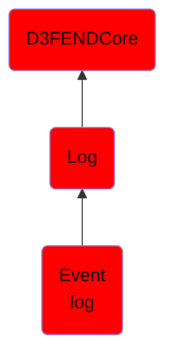

# Event log

## Overview

### Definition
Event logs record events taking place in the execution of a system in order to provide an audit trail that can be used to understand the activity of the system and to diagnose problems. They are essential to understand the activities of complex systems, particularly in the case of applications with little user interaction (such as server applications).

### Examples
Not defined.

### Aliases
Not defined.

### URI
http://d3fend.mitre.org/ontologies/d3fend.owl#EventLog

### Subclass Of

- [D3FENDCore](/docs/ontology/reference/model/D3FENDCore/D3FENDCore.md)
- [Log](/docs/ontology/reference/model/D3FENDCore/Log/Log.md)
- [Event log](/docs/ontology/reference/model/D3FENDCore/Log/Event%20log/Event%20log.md)

### Ontology Reference
- [d3fend](http://d3fend.mitre.org/ontologies/d3fend.owl#)

## Properties
