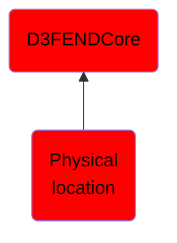

# Physical location

## Overview

### Definition
The terms location  [here, a physical location] and place in geography are used to identify a point or an area on the Earth's surface or elsewhere. The term location generally implies a higher degree of certainty than place, which often indicates an entity with an ambiguous boundary, relying more on human or social attributes of place identity and sense of place than on geometry. The distinction between space and place is considered a central concern of geography, and has been addressed by scholars such as Yi-Fu Tuan and John Agnew.

### Examples
Not defined.

### Aliases
Not defined.

### URI
http://d3fend.mitre.org/ontologies/d3fend.owl#PhysicalLocation

### Subclass Of

- [D3FENDCore](/docs/ontology/reference/model/D3FENDCore/D3FENDCore.md)
- [Physical location](/docs/ontology/reference/model/D3FENDCore/Physical%20location/Physical%20location.md)

### Ontology Reference
- [d3fend](http://d3fend.mitre.org/ontologies/d3fend.owl#)

## Properties
