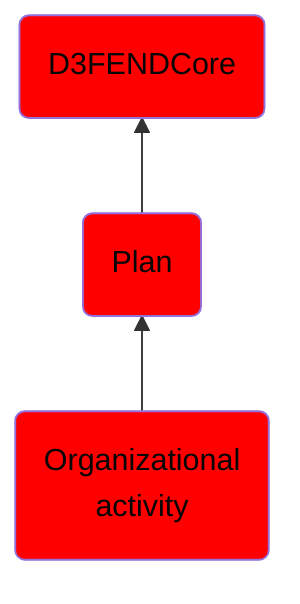

# Organizational activity

## Overview

### Definition
An activity is a specific behavior representing a set of actions that may be accomplished by an agent.

### Examples
Not defined.

### Aliases
Not defined.

### URI
http://d3fend.mitre.org/ontologies/d3fend.owl#OrganizationalActivity

### Subclass Of

- [D3FENDCore](/docs/ontology/reference/model/D3FENDCore/D3FENDCore.md)
- [Plan](/docs/ontology/reference/model/D3FENDCore/Plan/Plan.md)
- [Organizational activity](/docs/ontology/reference/model/D3FENDCore/Plan/Organizational%20activity/Organizational%20activity.md)

### Ontology Reference
- [d3fend](http://d3fend.mitre.org/ontologies/d3fend.owl#)

## Properties
