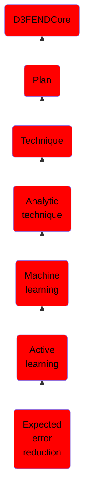

# Expected error reduction

## Overview

### Definition
Expected Error Reduction (EER) follows similar ideas as EMC, but again looks at the model output instead of the model itself and also takes the other data into account. In particular, a sample x is considered useful, if we can expect that knowing the label will reduce the future error on unseen samples

### Examples
Not defined.

### Aliases
Not defined.

### URI
http://d3fend.mitre.org/ontologies/d3fend.owl#ExpectedErrorReduction

### Subclass Of

- [D3FENDCore](/docs/ontology/reference/model/D3FENDCore/D3FENDCore.md)
- [Plan](/docs/ontology/reference/model/D3FENDCore/Plan/Plan.md)
- [Technique](/docs/ontology/reference/model/D3FENDCore/Plan/Technique/Technique.md)
- [Analytic technique](/docs/ontology/reference/model/D3FENDCore/Plan/Technique/Analytic%20technique/Analytic%20technique.md)
- [Machine learning](/docs/ontology/reference/model/D3FENDCore/Plan/Technique/Analytic%20technique/Machine%20learning/Machine%20learning.md)
- [Active learning](/docs/ontology/reference/model/D3FENDCore/Plan/Technique/Analytic%20technique/Machine%20learning/Active%20learning/Active%20learning.md)
- [Expected error reduction](/docs/ontology/reference/model/D3FENDCore/Plan/Technique/Analytic%20technique/Machine%20learning/Active%20learning/Expected%20error%20reduction/Expected%20error%20reduction.md)

### Ontology Reference
- [d3fend](http://d3fend.mitre.org/ontologies/d3fend.owl#)

## Properties
