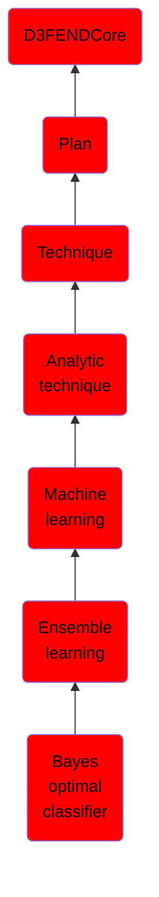

# Bayes optimal classifier

## Overview

### Definition
A probabilistic model that makes the most probable prediction for a new example.

### Examples
Not defined.

### Aliases
Not defined.

### URI
http://d3fend.mitre.org/ontologies/d3fend.owl#BayesOptimalClassifier

### Subclass Of

- [D3FENDCore](/docs/ontology/reference/model/D3FENDCore/D3FENDCore.md)
- [Plan](/docs/ontology/reference/model/D3FENDCore/Plan/Plan.md)
- [Technique](/docs/ontology/reference/model/D3FENDCore/Plan/Technique/Technique.md)
- [Analytic technique](/docs/ontology/reference/model/D3FENDCore/Plan/Technique/Analytic%20technique/Analytic%20technique.md)
- [Machine learning](/docs/ontology/reference/model/D3FENDCore/Plan/Technique/Analytic%20technique/Machine%20learning/Machine%20learning.md)
- [Ensemble learning](/docs/ontology/reference/model/D3FENDCore/Plan/Technique/Analytic%20technique/Machine%20learning/Ensemble%20learning/Ensemble%20learning.md)
- [Bayes optimal classifier](/docs/ontology/reference/model/D3FENDCore/Plan/Technique/Analytic%20technique/Machine%20learning/Ensemble%20learning/Bayes%20optimal%20classifier/Bayes%20optimal%20classifier.md)

### Ontology Reference
- [d3fend](http://d3fend.mitre.org/ontologies/d3fend.owl#)

## Properties
