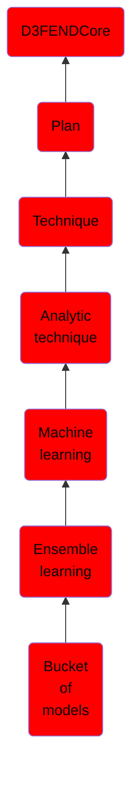

# Bucket of models

## Overview

### Definition
A "bucket of models" is an ensemble technique in which a model selection algorithm is used to choose the best model for each problem. When tested with only one problem, a bucket of models can produce no better results than the best model in the set, but when evaluated across many problems, it will typically produce much better results, on average, than any model in the set.

### Examples
Not defined.

### Aliases
Not defined.

### URI
http://d3fend.mitre.org/ontologies/d3fend.owl#BucketOfModels

### Subclass Of

- [D3FENDCore](/docs/ontology/reference/model/D3FENDCore/D3FENDCore.md)
- [Plan](/docs/ontology/reference/model/D3FENDCore/Plan/Plan.md)
- [Technique](/docs/ontology/reference/model/D3FENDCore/Plan/Technique/Technique.md)
- [Analytic technique](/docs/ontology/reference/model/D3FENDCore/Plan/Technique/Analytic%20technique/Analytic%20technique.md)
- [Machine learning](/docs/ontology/reference/model/D3FENDCore/Plan/Technique/Analytic%20technique/Machine%20learning/Machine%20learning.md)
- [Ensemble learning](/docs/ontology/reference/model/D3FENDCore/Plan/Technique/Analytic%20technique/Machine%20learning/Ensemble%20learning/Ensemble%20learning.md)
- [Bucket of models](/docs/ontology/reference/model/D3FENDCore/Plan/Technique/Analytic%20technique/Machine%20learning/Ensemble%20learning/Bucket%20of%20models/Bucket%20of%20models.md)

### Ontology Reference
- [d3fend](http://d3fend.mitre.org/ontologies/d3fend.owl#)

## Properties
