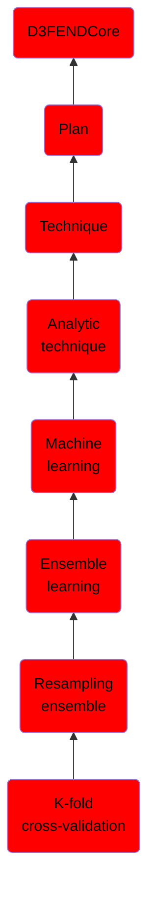

# K-fold cross-validation

## Overview

### Definition
Cross-validation is a resampling procedure used to evaluate machine learning models on a limited data sample. The procedure has a single parameter called k that refers to the number of groups that a given data sample is to be split into. As such, the procedure is often called k-fold cross-validation. When a specific value for k is chosen, it may be used in place of k in the reference to the model, such as k=10 becoming 10-fold cross-validation

### Examples
Not defined.

### Aliases
Not defined.

### URI
http://d3fend.mitre.org/ontologies/d3fend.owl#K-FoldCross-Validation

### Subclass Of

- [D3FENDCore](/docs/ontology/reference/model/D3FENDCore/D3FENDCore.md)
- [Plan](/docs/ontology/reference/model/D3FENDCore/Plan/Plan.md)
- [Technique](/docs/ontology/reference/model/D3FENDCore/Plan/Technique/Technique.md)
- [Analytic technique](/docs/ontology/reference/model/D3FENDCore/Plan/Technique/Analytic%20technique/Analytic%20technique.md)
- [Machine learning](/docs/ontology/reference/model/D3FENDCore/Plan/Technique/Analytic%20technique/Machine%20learning/Machine%20learning.md)
- [Ensemble learning](/docs/ontology/reference/model/D3FENDCore/Plan/Technique/Analytic%20technique/Machine%20learning/Ensemble%20learning/Ensemble%20learning.md)
- [Resampling ensemble](/docs/ontology/reference/model/D3FENDCore/Plan/Technique/Analytic%20technique/Machine%20learning/Ensemble%20learning/Resampling%20ensemble/Resampling%20ensemble.md)
- [K-fold cross-validation](/docs/ontology/reference/model/D3FENDCore/Plan/Technique/Analytic%20technique/Machine%20learning/Ensemble%20learning/Resampling%20ensemble/K-fold%20cross-validation/K-fold%20cross-validation.md)

### Ontology Reference
- [d3fend](http://d3fend.mitre.org/ontologies/d3fend.owl#)

## Properties
