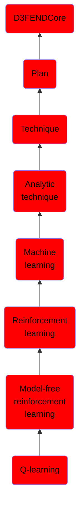

# Q-learning

## Overview

### Definition
Q-learning is a model-free reinforcement learning algorithm to learn the value of an action in a particular state. It does not require a model of the environment (hence "model-free"), and it can handle problems with stochastic transitions and rewards without requiring adaptations.

### Examples
Not defined.

### Aliases
Not defined.

### URI
http://d3fend.mitre.org/ontologies/d3fend.owl#Q-Learning

### Subclass Of

- [D3FENDCore](/docs/ontology/reference/model/D3FENDCore/D3FENDCore.md)
- [Plan](/docs/ontology/reference/model/D3FENDCore/Plan/Plan.md)
- [Technique](/docs/ontology/reference/model/D3FENDCore/Plan/Technique/Technique.md)
- [Analytic technique](/docs/ontology/reference/model/D3FENDCore/Plan/Technique/Analytic%20technique/Analytic%20technique.md)
- [Machine learning](/docs/ontology/reference/model/D3FENDCore/Plan/Technique/Analytic%20technique/Machine%20learning/Machine%20learning.md)
- [Reinforcement learning](/docs/ontology/reference/model/D3FENDCore/Plan/Technique/Analytic%20technique/Machine%20learning/Reinforcement%20learning/Reinforcement%20learning.md)
- [Model-free reinforcement learning](/docs/ontology/reference/model/D3FENDCore/Plan/Technique/Analytic%20technique/Machine%20learning/Reinforcement%20learning/Model-free%20reinforcement%20learning/Model-free%20reinforcement%20learning.md)
- [Q-learning](/docs/ontology/reference/model/D3FENDCore/Plan/Technique/Analytic%20technique/Machine%20learning/Reinforcement%20learning/Model-free%20reinforcement%20learning/Q-learning/Q-learning.md)

### Ontology Reference
- [d3fend](http://d3fend.mitre.org/ontologies/d3fend.owl#)

## Properties
