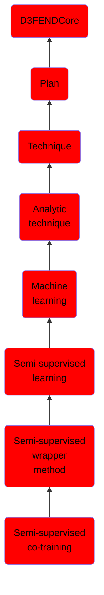

# Semi-supervised co-training

## Overview

### Definition
Multi-view co-training involves training the classifiers in completely different views of training data. On the other hand, single-view co-training methods are generally applied as ensemble methods.

### Examples
Not defined.

### Aliases
Not defined.

### URI
http://d3fend.mitre.org/ontologies/d3fend.owl#Semi-supervisedCo-training

### Subclass Of

- [D3FENDCore](/docs/ontology/reference/model/D3FENDCore/D3FENDCore.md)
- [Plan](/docs/ontology/reference/model/D3FENDCore/Plan/Plan.md)
- [Technique](/docs/ontology/reference/model/D3FENDCore/Plan/Technique/Technique.md)
- [Analytic technique](/docs/ontology/reference/model/D3FENDCore/Plan/Technique/Analytic%20technique/Analytic%20technique.md)
- [Machine learning](/docs/ontology/reference/model/D3FENDCore/Plan/Technique/Analytic%20technique/Machine%20learning/Machine%20learning.md)
- [Semi-supervised learning](/docs/ontology/reference/model/D3FENDCore/Plan/Technique/Analytic%20technique/Machine%20learning/Semi-supervised%20learning/Semi-supervised%20learning.md)
- [Semi-supervised wrapper method](/docs/ontology/reference/model/D3FENDCore/Plan/Technique/Analytic%20technique/Machine%20learning/Semi-supervised%20learning/Semi-supervised%20wrapper%20method/Semi-supervised%20wrapper%20method.md)
- [Semi-supervised co-training](/docs/ontology/reference/model/D3FENDCore/Plan/Technique/Analytic%20technique/Machine%20learning/Semi-supervised%20learning/Semi-supervised%20wrapper%20method/Semi-supervised%20co-training/Semi-supervised%20co-training.md)

### Ontology Reference
- [d3fend](http://d3fend.mitre.org/ontologies/d3fend.owl#)

## Properties
