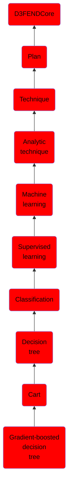

# Gradient-boosted decision tree

## Overview

### Definition
A gradient-boosted decision tree is, as in other bagging and boosting methods, a method where the relatively 'weak' machine learning model (a decision tree) is used in an ensemble to form a 'strong' machine learning model.

### Examples
Not defined.

### Aliases
Not defined.

### URI
http://d3fend.mitre.org/ontologies/d3fend.owl#GradientBoostedDecisionTree

### Subclass Of

- [D3FENDCore](/docs/ontology/reference/model/D3FENDCore/D3FENDCore.md)
- [Plan](/docs/ontology/reference/model/D3FENDCore/Plan/Plan.md)
- [Technique](/docs/ontology/reference/model/D3FENDCore/Plan/Technique/Technique.md)
- [Analytic technique](/docs/ontology/reference/model/D3FENDCore/Plan/Technique/Analytic%20technique/Analytic%20technique.md)
- [Machine learning](/docs/ontology/reference/model/D3FENDCore/Plan/Technique/Analytic%20technique/Machine%20learning/Machine%20learning.md)
- [Supervised learning](/docs/ontology/reference/model/D3FENDCore/Plan/Technique/Analytic%20technique/Machine%20learning/Supervised%20learning/Supervised%20learning.md)
- [Classification](/docs/ontology/reference/model/D3FENDCore/Plan/Technique/Analytic%20technique/Machine%20learning/Supervised%20learning/Classification/Classification.md)
- [Decision tree](/docs/ontology/reference/model/D3FENDCore/Plan/Technique/Analytic%20technique/Machine%20learning/Supervised%20learning/Classification/Decision%20tree/Decision%20tree.md)
- [Cart](/docs/ontology/reference/model/D3FENDCore/Plan/Technique/Analytic%20technique/Machine%20learning/Supervised%20learning/Classification/Decision%20tree/Cart/Cart.md)
- [Gradient-boosted decision tree](/docs/ontology/reference/model/D3FENDCore/Plan/Technique/Analytic%20technique/Machine%20learning/Supervised%20learning/Classification/Decision%20tree/Cart/Gradient-boosted%20decision%20tree/Gradient-boosted%20decision%20tree.md)

### Ontology Reference
- [d3fend](http://d3fend.mitre.org/ontologies/d3fend.owl#)

## Properties
