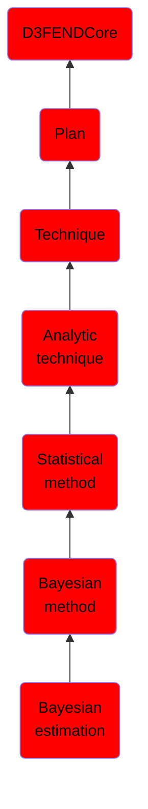

# Bayesian estimation

## Overview

### Definition
A Bayes estimator or a Bayes action is an estimator or decision rule that minimizes the posterior expected value of a loss function (i.e., the posterior expected loss).

### Examples
Not defined.

### Aliases
Not defined.

### URI
http://d3fend.mitre.org/ontologies/d3fend.owl#BayesianEstimation

### Subclass Of

- [D3FENDCore](/docs/ontology/reference/model/D3FENDCore/D3FENDCore.md)
- [Plan](/docs/ontology/reference/model/D3FENDCore/Plan/Plan.md)
- [Technique](/docs/ontology/reference/model/D3FENDCore/Plan/Technique/Technique.md)
- [Analytic technique](/docs/ontology/reference/model/D3FENDCore/Plan/Technique/Analytic%20technique/Analytic%20technique.md)
- [Statistical method](/docs/ontology/reference/model/D3FENDCore/Plan/Technique/Analytic%20technique/Statistical%20method/Statistical%20method.md)
- [Bayesian method](/docs/ontology/reference/model/D3FENDCore/Plan/Technique/Analytic%20technique/Statistical%20method/Bayesian%20method/Bayesian%20method.md)
- [Bayesian estimation](/docs/ontology/reference/model/D3FENDCore/Plan/Technique/Analytic%20technique/Statistical%20method/Bayesian%20method/Bayesian%20estimation/Bayesian%20estimation.md)

### Ontology Reference
- [d3fend](http://d3fend.mitre.org/ontologies/d3fend.owl#)

## Properties
