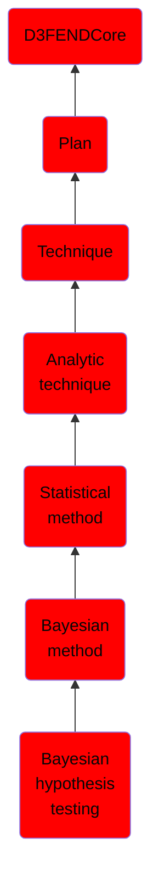

# Bayesian hypothesis testing

## Overview

### Definition
Bayesian hypothesis testing can be framed as a special case of model comparison where a model refers to a likelihood function and a prior distribution.

### Examples
Not defined.

### Aliases
Not defined.

### URI
http://d3fend.mitre.org/ontologies/d3fend.owl#BayesianHypothesisTesting

### Subclass Of

- [D3FENDCore](/docs/ontology/reference/model/D3FENDCore/D3FENDCore.md)
- [Plan](/docs/ontology/reference/model/D3FENDCore/Plan/Plan.md)
- [Technique](/docs/ontology/reference/model/D3FENDCore/Plan/Technique/Technique.md)
- [Analytic technique](/docs/ontology/reference/model/D3FENDCore/Plan/Technique/Analytic%20technique/Analytic%20technique.md)
- [Statistical method](/docs/ontology/reference/model/D3FENDCore/Plan/Technique/Analytic%20technique/Statistical%20method/Statistical%20method.md)
- [Bayesian method](/docs/ontology/reference/model/D3FENDCore/Plan/Technique/Analytic%20technique/Statistical%20method/Bayesian%20method/Bayesian%20method.md)
- [Bayesian hypothesis testing](/docs/ontology/reference/model/D3FENDCore/Plan/Technique/Analytic%20technique/Statistical%20method/Bayesian%20method/Bayesian%20hypothesis%20testing/Bayesian%20hypothesis%20testing.md)

### Ontology Reference
- [d3fend](http://d3fend.mitre.org/ontologies/d3fend.owl#)

## Properties
