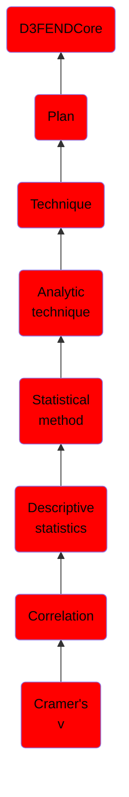

# Cramer's v

## Overview

### Definition
Cramér's V (sometimes referred to as Cramér's phi and denoted as φc) is a measure of association between two nominal variables, giving a value between 0 and +1 (inclusive) and is based on Pearson's chi-squared statistic.

### Examples
Not defined.

### Aliases
Not defined.

### URI
http://d3fend.mitre.org/ontologies/d3fend.owl#CramersV

### Subclass Of

- [D3FENDCore](/docs/ontology/reference/model/D3FENDCore/D3FENDCore.md)
- [Plan](/docs/ontology/reference/model/D3FENDCore/Plan/Plan.md)
- [Technique](/docs/ontology/reference/model/D3FENDCore/Plan/Technique/Technique.md)
- [Analytic technique](/docs/ontology/reference/model/D3FENDCore/Plan/Technique/Analytic%20technique/Analytic%20technique.md)
- [Statistical method](/docs/ontology/reference/model/D3FENDCore/Plan/Technique/Analytic%20technique/Statistical%20method/Statistical%20method.md)
- [Descriptive statistics](/docs/ontology/reference/model/D3FENDCore/Plan/Technique/Analytic%20technique/Statistical%20method/Descriptive%20statistics/Descriptive%20statistics.md)
- [Correlation](/docs/ontology/reference/model/D3FENDCore/Plan/Technique/Analytic%20technique/Statistical%20method/Descriptive%20statistics/Correlation/Correlation.md)
- [Cramer's v](/docs/ontology/reference/model/D3FENDCore/Plan/Technique/Analytic%20technique/Statistical%20method/Descriptive%20statistics/Correlation/Cramer%27s%20v/Cramer%27s%20v.md)

### Ontology Reference
- [d3fend](http://d3fend.mitre.org/ontologies/d3fend.owl#)

## Properties
