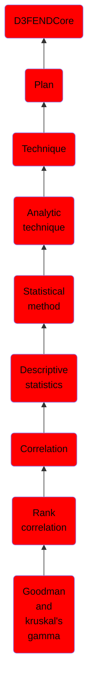

# Goodman and kruskal's gamma

## Overview

### Definition
Goodman-Kruskal $\\gamma$ is a measure of rank correlation between x and y and is given by $(n_c -n_d) / (n_c + n_d)$, where $n_c$ is the number of concordant pairs of the observations and $n_d$ is the number of discordant pairs.

### Examples
Not defined.

### Aliases
Not defined.

### URI
http://d3fend.mitre.org/ontologies/d3fend.owl#GoodmanAndKruskalsGamma

### Subclass Of

- [D3FENDCore](/docs/ontology/reference/model/D3FENDCore/D3FENDCore.md)
- [Plan](/docs/ontology/reference/model/D3FENDCore/Plan/Plan.md)
- [Technique](/docs/ontology/reference/model/D3FENDCore/Plan/Technique/Technique.md)
- [Analytic technique](/docs/ontology/reference/model/D3FENDCore/Plan/Technique/Analytic%20technique/Analytic%20technique.md)
- [Statistical method](/docs/ontology/reference/model/D3FENDCore/Plan/Technique/Analytic%20technique/Statistical%20method/Statistical%20method.md)
- [Descriptive statistics](/docs/ontology/reference/model/D3FENDCore/Plan/Technique/Analytic%20technique/Statistical%20method/Descriptive%20statistics/Descriptive%20statistics.md)
- [Correlation](/docs/ontology/reference/model/D3FENDCore/Plan/Technique/Analytic%20technique/Statistical%20method/Descriptive%20statistics/Correlation/Correlation.md)
- [Rank correlation](/docs/ontology/reference/model/D3FENDCore/Plan/Technique/Analytic%20technique/Statistical%20method/Descriptive%20statistics/Correlation/Rank%20correlation/Rank%20correlation.md)
- [Goodman and kruskal's gamma](/docs/ontology/reference/model/D3FENDCore/Plan/Technique/Analytic%20technique/Statistical%20method/Descriptive%20statistics/Correlation/Rank%20correlation/Goodman%20and%20kruskal%27s%20gamma/Goodman%20and%20kruskal%27s%20gamma.md)

### Ontology Reference
- [d3fend](http://d3fend.mitre.org/ontologies/d3fend.owl#)

## Properties
