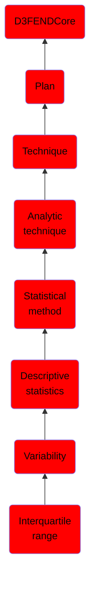

# Interquartile range

## Overview

### Definition
The interquartile range (IQR) is a measure of statistical dispersion, which is the spread of the data and is defined as the difference between the 75th and 25th percentiles of the data.

### Examples
Not defined.

### Aliases
Not defined.

### URI
http://d3fend.mitre.org/ontologies/d3fend.owl#InterquartileRange

### Subclass Of

- [D3FENDCore](/docs/ontology/reference/model/D3FENDCore/D3FENDCore.md)
- [Plan](/docs/ontology/reference/model/D3FENDCore/Plan/Plan.md)
- [Technique](/docs/ontology/reference/model/D3FENDCore/Plan/Technique/Technique.md)
- [Analytic technique](/docs/ontology/reference/model/D3FENDCore/Plan/Technique/Analytic%20technique/Analytic%20technique.md)
- [Statistical method](/docs/ontology/reference/model/D3FENDCore/Plan/Technique/Analytic%20technique/Statistical%20method/Statistical%20method.md)
- [Descriptive statistics](/docs/ontology/reference/model/D3FENDCore/Plan/Technique/Analytic%20technique/Statistical%20method/Descriptive%20statistics/Descriptive%20statistics.md)
- [Variability](/docs/ontology/reference/model/D3FENDCore/Plan/Technique/Analytic%20technique/Statistical%20method/Descriptive%20statistics/Variability/Variability.md)
- [Interquartile range](/docs/ontology/reference/model/D3FENDCore/Plan/Technique/Analytic%20technique/Statistical%20method/Descriptive%20statistics/Variability/Interquartile%20range/Interquartile%20range.md)

### Ontology Reference
- [d3fend](http://d3fend.mitre.org/ontologies/d3fend.owl#)

## Properties
