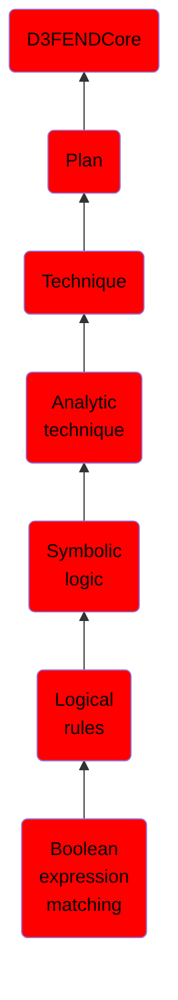

# Boolean expression matching

## Overview

### Definition
Boolean expression matching produces a Boolean truth value for a given boolean expression and assignment of values to variables in the expression.

### Examples
Not defined.

### Aliases
Not defined.

### URI
http://d3fend.mitre.org/ontologies/d3fend.owl#BooleanExpressionMatching

### Subclass Of

- [D3FENDCore](/docs/ontology/reference/model/D3FENDCore/D3FENDCore.md)
- [Plan](/docs/ontology/reference/model/D3FENDCore/Plan/Plan.md)
- [Technique](/docs/ontology/reference/model/D3FENDCore/Plan/Technique/Technique.md)
- [Analytic technique](/docs/ontology/reference/model/D3FENDCore/Plan/Technique/Analytic%20technique/Analytic%20technique.md)
- [Symbolic logic](/docs/ontology/reference/model/D3FENDCore/Plan/Technique/Analytic%20technique/Symbolic%20logic/Symbolic%20logic.md)
- [Logical rules](/docs/ontology/reference/model/D3FENDCore/Plan/Technique/Analytic%20technique/Symbolic%20logic/Logical%20rules/Logical%20rules.md)
- [Boolean expression matching](/docs/ontology/reference/model/D3FENDCore/Plan/Technique/Analytic%20technique/Symbolic%20logic/Logical%20rules/Boolean%20expression%20matching/Boolean%20expression%20matching.md)

### Ontology Reference
- [d3fend](http://d3fend.mitre.org/ontologies/d3fend.owl#)

## Properties
