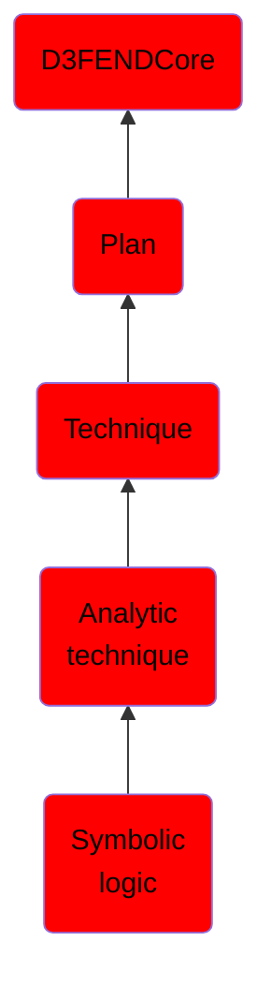

# Symbolic logic

## Overview

### Definition
Symbolic Logic, also known as formal logic, is a branch of mathematics that uses symbolic representations for logical expressions and relationships. It provides a systematic method for examining the structure of arguments and reasoning, focusing on the relationships between propositions rather than the content of those propositions.

### Examples
Not defined.

### Aliases
Not defined.

### URI
http://d3fend.mitre.org/ontologies/d3fend.owl#SymbolicLogic

### Subclass Of

- [D3FENDCore](/docs/ontology/reference/model/D3FENDCore/D3FENDCore.md)
- [Plan](/docs/ontology/reference/model/D3FENDCore/Plan/Plan.md)
- [Technique](/docs/ontology/reference/model/D3FENDCore/Plan/Technique/Technique.md)
- [Analytic technique](/docs/ontology/reference/model/D3FENDCore/Plan/Technique/Analytic%20technique/Analytic%20technique.md)
- [Symbolic logic](/docs/ontology/reference/model/D3FENDCore/Plan/Technique/Analytic%20technique/Symbolic%20logic/Symbolic%20logic.md)

### Ontology Reference
- [d3fend](http://d3fend.mitre.org/ontologies/d3fend.owl#)

## Properties
