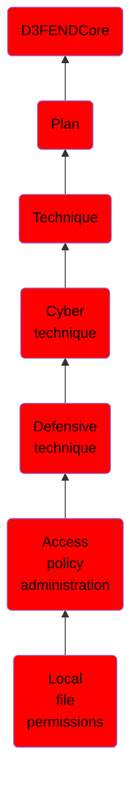

# Local file permissions

## Overview

### Definition
Local file permissions is the systematic process of defining, implementing, and managing access control policies that dictate user permissions for accessing files on a local system through the configuration of operating system functionality.

### Examples
Not defined.

### Aliases
Not defined.

### URI
http://d3fend.mitre.org/ontologies/d3fend.owl#LocalFilePermissions

### Subclass Of

- [D3FENDCore](/docs/ontology/reference/model/D3FENDCore/D3FENDCore.md)
- [Plan](/docs/ontology/reference/model/D3FENDCore/Plan/Plan.md)
- [Technique](/docs/ontology/reference/model/D3FENDCore/Plan/Technique/Technique.md)
- [Cyber technique](/docs/ontology/reference/model/D3FENDCore/Plan/Technique/Cyber%20technique/Cyber%20technique.md)
- [Defensive technique](/docs/ontology/reference/model/D3FENDCore/Plan/Technique/Cyber%20technique/Defensive%20technique/Defensive%20technique.md)
- [Access policy administration](/docs/ontology/reference/model/D3FENDCore/Plan/Technique/Cyber%20technique/Defensive%20technique/Access%20policy%20administration/Access%20policy%20administration.md)
- [Local file permissions](/docs/ontology/reference/model/D3FENDCore/Plan/Technique/Cyber%20technique/Defensive%20technique/Access%20policy%20administration/Local%20file%20permissions/Local%20file%20permissions.md)

### Ontology Reference
- [d3fend](http://d3fend.mitre.org/ontologies/d3fend.owl#)

## Properties
