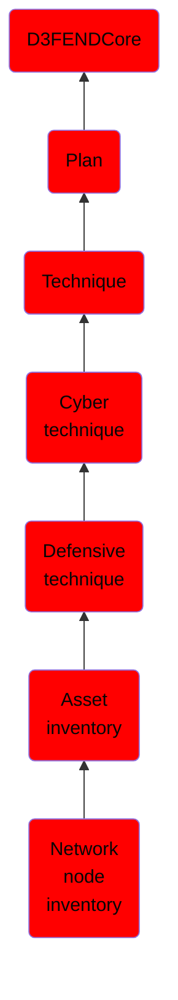

# Network node inventory

## Overview

### Definition
Network node inventorying identifies and records all the network nodes (hosts, routers, switches, firewalls, etc.) in the organization's architecture.

### Examples
Not defined.

### Aliases
Not defined.

### URI
http://d3fend.mitre.org/ontologies/d3fend.owl#NetworkNodeInventory

### Subclass Of

- [D3FENDCore](/docs/ontology/reference/model/D3FENDCore/D3FENDCore.md)
- [Plan](/docs/ontology/reference/model/D3FENDCore/Plan/Plan.md)
- [Technique](/docs/ontology/reference/model/D3FENDCore/Plan/Technique/Technique.md)
- [Cyber technique](/docs/ontology/reference/model/D3FENDCore/Plan/Technique/Cyber%20technique/Cyber%20technique.md)
- [Defensive technique](/docs/ontology/reference/model/D3FENDCore/Plan/Technique/Cyber%20technique/Defensive%20technique/Defensive%20technique.md)
- [Asset inventory](/docs/ontology/reference/model/D3FENDCore/Plan/Technique/Cyber%20technique/Defensive%20technique/Asset%20inventory/Asset%20inventory.md)
- [Network node inventory](/docs/ontology/reference/model/D3FENDCore/Plan/Technique/Cyber%20technique/Defensive%20technique/Asset%20inventory/Network%20node%20inventory/Network%20node%20inventory.md)

### Ontology Reference
- [d3fend](http://d3fend.mitre.org/ontologies/d3fend.owl#)

## Properties
