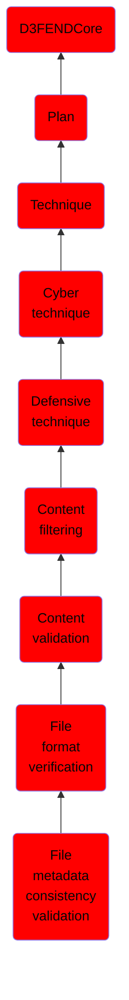

# File metadata consistency validation

## Overview

### Definition
The process of validating the consistency between a file's metadata and its actual content, ensuring that elements like declared lengths, pointers, and checksums accurately describe the file's content.

### Examples
Not defined.

### Aliases
Not defined.

### URI
http://d3fend.mitre.org/ontologies/d3fend.owl#FileMetadataConsistencyValidation

### Subclass Of

- [D3FENDCore](/docs/ontology/reference/model/D3FENDCore/D3FENDCore.md)
- [Plan](/docs/ontology/reference/model/D3FENDCore/Plan/Plan.md)
- [Technique](/docs/ontology/reference/model/D3FENDCore/Plan/Technique/Technique.md)
- [Cyber technique](/docs/ontology/reference/model/D3FENDCore/Plan/Technique/Cyber%20technique/Cyber%20technique.md)
- [Defensive technique](/docs/ontology/reference/model/D3FENDCore/Plan/Technique/Cyber%20technique/Defensive%20technique/Defensive%20technique.md)
- [Content filtering](/docs/ontology/reference/model/D3FENDCore/Plan/Technique/Cyber%20technique/Defensive%20technique/Content%20filtering/Content%20filtering.md)
- [Content validation](/docs/ontology/reference/model/D3FENDCore/Plan/Technique/Cyber%20technique/Defensive%20technique/Content%20filtering/Content%20validation/Content%20validation.md)
- [File format verification](/docs/ontology/reference/model/D3FENDCore/Plan/Technique/Cyber%20technique/Defensive%20technique/Content%20filtering/Content%20validation/File%20format%20verification/File%20format%20verification.md)
- [File metadata consistency validation](/docs/ontology/reference/model/D3FENDCore/Plan/Technique/Cyber%20technique/Defensive%20technique/Content%20filtering/Content%20validation/File%20format%20verification/File%20metadata%20consistency%20validation/File%20metadata%20consistency%20validation.md)

### Ontology Reference
- [d3fend](http://d3fend.mitre.org/ontologies/d3fend.owl#)

## Properties
