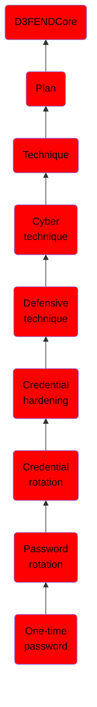

# One-time password

## Overview

### Definition
A one-time password is valid for only one user authentication.

### Examples
Not defined.

### Aliases
Not defined.

### URI
http://d3fend.mitre.org/ontologies/d3fend.owl#One-timePassword

### Subclass Of

- [D3FENDCore](/docs/ontology/reference/model/D3FENDCore/D3FENDCore.md)
- [Plan](/docs/ontology/reference/model/D3FENDCore/Plan/Plan.md)
- [Technique](/docs/ontology/reference/model/D3FENDCore/Plan/Technique/Technique.md)
- [Cyber technique](/docs/ontology/reference/model/D3FENDCore/Plan/Technique/Cyber%20technique/Cyber%20technique.md)
- [Defensive technique](/docs/ontology/reference/model/D3FENDCore/Plan/Technique/Cyber%20technique/Defensive%20technique/Defensive%20technique.md)
- [Credential hardening](/docs/ontology/reference/model/D3FENDCore/Plan/Technique/Cyber%20technique/Defensive%20technique/Credential%20hardening/Credential%20hardening.md)
- [Credential rotation](/docs/ontology/reference/model/D3FENDCore/Plan/Technique/Cyber%20technique/Defensive%20technique/Credential%20hardening/Credential%20rotation/Credential%20rotation.md)
- [Password rotation](/docs/ontology/reference/model/D3FENDCore/Plan/Technique/Cyber%20technique/Defensive%20technique/Credential%20hardening/Credential%20rotation/Password%20rotation/Password%20rotation.md)
- [One-time password](/docs/ontology/reference/model/D3FENDCore/Plan/Technique/Cyber%20technique/Defensive%20technique/Credential%20hardening/Credential%20rotation/Password%20rotation/One-time%20password/One-time%20password.md)

### Ontology Reference
- [d3fend](http://d3fend.mitre.org/ontologies/d3fend.owl#)

## Properties
